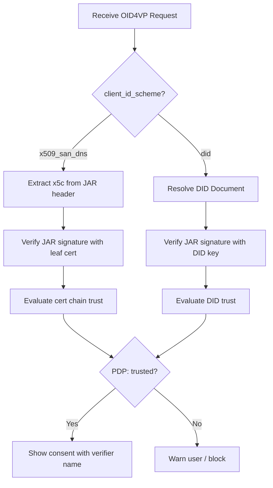

# Verifier Identity & Trust

This guide explains how a SIROS ID Verifier identifies itself to wallets and how wallets evaluate verifier trust. The verifier's identity determines how wallets verify the authenticity of presentation requests.

## Client ID Schemes

When the verifier sends an OID4VP request to a wallet, it includes a `client_id` that tells the wallet who is asking for credentials. The format of this identifier is called the **client_id_scheme**.

| Scheme | Format | Trust Resolution |
|--------|--------|-----------------|
| `x509_san_dns` (default) | `x509_san_dns:verifier.example.com` | Wallet verifies X.509 cert chain via ETSI TSL or CA trust |
| `did` | `did:web:verifier.example.com` | Wallet resolves DID Document, verifies signature against DID keys |

### X.509 SAN DNS (Default)

The default scheme. The verifier signs JARs (JWT Authorization Requests) with its X.509 certificate, and includes the certificate chain in the `x5c` JWT header. The wallet validates the chain against trust lists.

```yaml
verifier:
  public_url: "https://verifier.example.com"
  key_config:
    private_key_path: /pki/verifier.key
    chain_path: /pki/chain.pem
  # client_id_scheme defaults to "x509_san_dns"
```

The `client_id` sent to wallets will be `x509_san_dns:verifier.example.com`.

### DID-Based Identity

For verifiers that want to be discoverable via DID resolution (useful when trust is established through DID-based registries like LoTE rather than X.509 certificate chains).

```yaml
verifier:
  public_url: "https://verifier.example.com"
  client_id_scheme: "did"
  did: "did:web:verifier.example.com"
  key_config:
    private_key_path: /pki/verifier.key
    chain_path: /pki/chain.pem
```

When `client_id_scheme: "did"` is configured:
- The verifier's `client_id` in OID4VP requests is `did:web:verifier.example.com`
- A DID Document is served at `/.well-known/did.json` derived from the signing key
- Wallets resolve the DID Document to obtain the verification key

#### DID Document

The verifier automatically serves a DID Document at `GET /.well-known/did.json`:

```json
{
  "@context": ["https://www.w3.org/ns/did/v1", "https://w3id.org/security/suites/jws-2020/v1"],
  "id": "did:web:verifier.example.com",
  "verificationMethod": [{
    "id": "did:web:verifier.example.com#key-1",
    "type": "JsonWebKey2020",
    "controller": "did:web:verifier.example.com",
    "publicKeyJwk": { "kty": "EC", "crv": "P-256", "x": "...", "y": "..." }
  }],
  "authentication": ["did:web:verifier.example.com#key-1"],
  "assertionMethod": ["did:web:verifier.example.com#key-1"]
}
```

## OpenID Federation Entity Configuration

Both the issuer and verifier can participate in [OpenID Federation](./openid-federation.md) by serving an entity configuration. This enables wallets and other parties to discover and validate the service through federation trust chains.

```yaml
federation:
  enabled: true
  entity_id: "https://verifier.example.com"  # defaults to public_url
  authority_hints:
    - "https://federation.sunet.se"
  organization_name: "Example University"
  logo_uri: "https://verifier.example.com/logo.png"
  ttl: 86400  # seconds
```

When enabled, both the APIGW (issuer) and verifier serve a self-signed JWT at:

```
GET /.well-known/openid-federation
Content-Type: application/entity-statement+jwt
```

The entity configuration contains:
- **`iss` / `sub`** — The entity identifier (equal, self-asserted)
- **`jwks`** — The entity's signing key(s)
- **`authority_hints`** — Parent entities in the federation hierarchy
- **`metadata`** — Service-specific metadata:
  - `openid_credential_issuer` (for APIGW)
  - `openid_relying_party` (for verifier)
  - `federation_entity` (organization info)

### Becoming a Federation Participant

To participate in a federation:

1. Configure the `federation` section in your YAML config
2. Deploy — the `/.well-known/openid-federation` endpoint is served automatically
3. Request a **subordinate statement** from your Trust Anchor (e.g., via [Inmor](https://github.com/SUNET/inmor))
4. Wallets can now resolve your trust chain from the TA down to your entity

See [OpenID Federation](./openid-federation.md) for details on Trust Anchor setup and entity onboarding.

## How Wallets Evaluate Verifier Trust

When a wallet receives an OID4VP request, it evaluates the verifier's identity:



The wallet's backend (go-wallet-backend) sends a trust evaluation request to its Go-Trust PDP, which checks the verifier's key against:
- **ETSI Trust Status Lists** (for X.509 certificate chains)
- **OpenID Federation trust chains** (for federation participants)
- **LoTE registries** (for DID-based verifiers)

## Related

- [Trust Services Overview](./index.md) — All supported trust frameworks
- [OpenID Federation](./openid-federation.md) — Joining a federation
- [Verifier Configuration](../verifiers/verifier.md) — Full verifier setup guide
- [Wallet Attestation](./wallet-attestation.md) — How wallets authenticate to issuers
