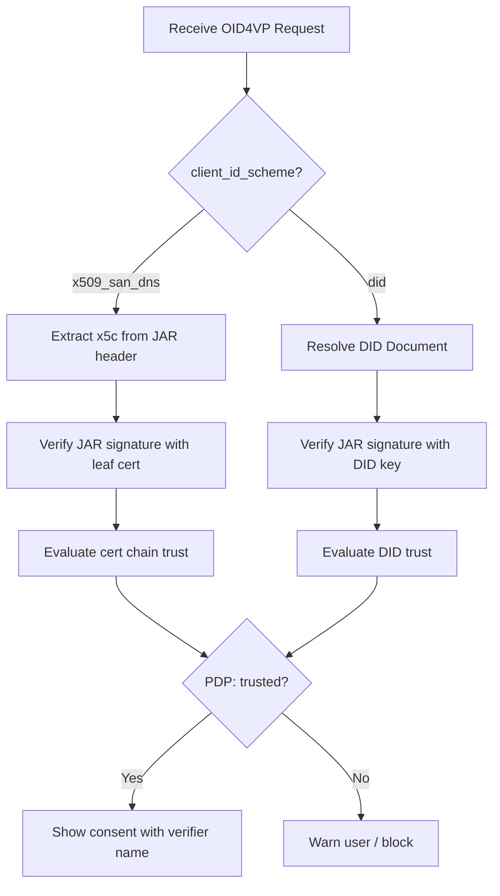

# Verifier Identity & Trust

This guide explains how a SIROS ID Verifier identifies itself to wallets and how wallets evaluate verifier trust. The verifier's identity determines how wallets verify the authenticity of presentation requests.

## Client ID Schemes

When the verifier sends an OID4VP request to a wallet, it includes a `client_id` that tells the wallet who is asking for credentials. The format of this identifier is called the **client_id_scheme**.

| Scheme | Format | Trust Resolution |
|--------|--------|-----------------|
| `x509_san_dns` (default) | `x509_san_dns:verifier.example.com` | Wallet verifies the X.509 chain from `x5c` via ETSI TSL or CA trust, and checks the DNS name appears as a dNSName SAN |
| `x509_hash` | `x509_hash:<sha256-of-leaf>` | Wallet pins the exact leaf certificate by digest; no chain validation |
| `did` | `did:web:verifier.example.com` | Wallet resolves the DID Document and verifies the signature against the DID's keys |

`verifier.client_id_scheme` accepts exactly these three values.

### X.509 SAN DNS (Default)

The default scheme. The verifier signs JARs (JWT Authorization Requests) with its X.509 certificate, and includes the certificate chain in the `x5c` JWT header. The wallet validates the chain against trust lists.

```yaml
verifier:
  public_url: "https://verifier.example.com"
  key_config:
    private_key_path: /pki/verifier.key
    chain_path: /pki/chain.pem
  # client_id_scheme defaults to "x509_san_dns"
```

The `client_id` sent to wallets will be `x509_san_dns:verifier.example.com`.

### DID-Based Identity

For verifiers that want to be discoverable via DID resolution (useful when trust is established through DID-based registries like LoTE rather than X.509 certificate chains).

```yaml
verifier:
  public_url: "https://verifier.example.com"
  client_id_scheme: "did"
  did: "did:web:verifier.example.com"
  key_config:
    private_key_path: /pki/verifier.key
    chain_path: /pki/chain.pem
```

When `client_id_scheme: "did"` is configured:
- The verifier's `client_id` in OID4VP requests is `did:web:verifier.example.com`
- A DID Document is served at `/.well-known/did.json` derived from the signing key
- Wallets resolve the DID Document to obtain the verification key

#### DID Document

The verifier automatically serves a DID Document at `GET /.well-known/did.json`:

```json
{
  "@context": ["https://www.w3.org/ns/did/v1", "https://w3id.org/security/suites/jws-2020/v1"],
  "id": "did:web:verifier.example.com",
  "verificationMethod": [{
    "id": "did:web:verifier.example.com#key-1",
    "type": "JsonWebKey2020",
    "controller": "did:web:verifier.example.com",
    "publicKeyJwk": { "kty": "EC", "crv": "P-256", "x": "...", "y": "..." }
  }],
  "authentication": ["did:web:verifier.example.com#key-1"],
  "assertionMethod": ["did:web:verifier.example.com#key-1"]
}
```

## EUDI Relying Party Certificates

Beyond identifying itself cryptographically, a verifier operating in the EUDI
ecosystem carries two Registrar-issued documents. They answer different
questions and are configured independently.

| | **WRPAC** — access certificate | **WRPRC** — registration certificate |
|---|---|---|
| Question it answers | *Is this the party it claims to be?* | *What is this party registered to request?* |
| Form | X.509 certificate + key, per ETSI TS 119 411-8 | A compact JWT, media type `rc-wrp+jwt`, per ETSI TS 119 475 |
| Travels as | The `x5c` chain on the signed request | The OpenID4VP `verifier_info` request parameter |
| Config key | `verifier.access_certificate` | `verifier.registration_certificate` |

### Access Certificate (WRPAC)

`access_certificate` does not supply the certificate — that is
`verifier.key_config` — it enforces the WRPAC profile against it at startup:

```yaml
verifier:
  access_certificate:
    # Enforce the profile at startup: keyUsage must include nonRepudiation,
    # subjectAltName must carry a contact, certificatePolicies must contain
    # a recognised WRPAC policy OID
    validate: true
    # Optionally narrow which policy OIDs are accepted, for a deployment
    # that must assert a specific assurance level
    allowed_policy_oids:
      - "0.4.0.194118.1.3"   # QCP-n-eudiwrp
      - "0.4.0.194118.1.4"   # QCP-l-eudiwrp
```

Off by default; deployments outside an ARF trust framework are unaffected. See
[RP Certificate Profiles](./go-trust#rp-certificate-profiles) for the OID table
and what a verifying party checks.

### Registration Certificate (WRPRC)

vc does not issue these. A national Registrar issues a WRPRC out of band,
attesting what the party is registered to do; the configuration just points at
the resulting file:

```yaml
verifier:
  registration_certificate:
    file_path: "/pki/wrprc.jwt"
    # Format identifier advertised alongside it; override only for an
    # ecosystem that has profiled a different identifier
    format: "rc-wrp+jwt"
    revocation:
      mode: "warn"            # off | warn | fail
      refresh_interval: "1h"
```

The same document travels in both directions, which is why one configuration
type serves both sides: a verifier conveys it in `verifier_info` to attest what
it may request, and a credential issuer conveys the same thing in OpenID4VCI
`issuer_info` (`apigw.issuer_metadata.registration_certificate`) to attest what
it may provide. Either way it feeds the wallet's consent dialog and policy
checks.

:::caution Revocation policy is recorded, not yet enforced
The `revocation` block is the policy half only — it says what a check result
should mean. No scheduler runs the check yet, so configuring it today records
intent without anything being verified. `warn` is the deliberate default: an
unreachable CRL or status list is evidence of neither revocation nor validity,
so it is reported as undetermined and the service proceeds. Choose `fail` only
if you would rather stop than carry on without an answer.

This is operational hygiene rather than a security control — a wallet checks
independently regardless. What it buys is learning that your certificate was
revoked before your users do.
:::

An issuer needs the same pair, because under CIR (EU) 2025/848 a PID or
attestation provider is a registered relying party in its own right:
`issuer.access_certificate` is deliberately separate from `issuer.key_config`,
since the credential signing key, an mdoc document-signer certificate and a
WRPAC follow three different profiles and rotate independently. Conflating them
would make a WRPAC rotation force a credential-key rotation.

## OpenID Federation Entity Configuration

Both the issuer and verifier can participate in [OpenID Federation](./openid-federation.md) by serving an entity configuration. This enables wallets and other parties to discover and validate the service through federation trust chains.

The `federation` block is nested under the service it belongs to —
`verifier.federation` for the verifier, `apigw.federation` for the issuance
front end:

```yaml
verifier:
  federation:
    enabled: true
    entity_id: "https://verifier.example.com"  # defaults to public_url
    authority_hints:
      - "https://federation.sunet.se"
    organization_name: "Example University"
    logo_uri: "https://verifier.example.com/logo.png"
    ttl: 86400  # seconds
    # Optional: pre-issued trust marks
    # trust_marks:
    #   - id: "https://federation.sunet.se/tm/rp"
    #     jwt: "eyJ..."
```

When enabled, both the APIGW (issuer) and verifier serve a self-signed JWT at:

```
GET /.well-known/openid-federation
Content-Type: application/entity-statement+jwt
```

The entity configuration contains:
- **`iss` / `sub`** — The entity identifier (equal, self-asserted)
- **`jwks`** — The entity's signing key(s)
- **`authority_hints`** — Parent entities in the federation hierarchy
- **`metadata`** — Service-specific metadata:
  - `openid_credential_issuer` (for APIGW)
  - `openid_relying_party` (for verifier)
  - `federation_entity` (organization info)

### Becoming a Federation Participant

To participate in a federation:

1. Configure the `federation` section in your YAML config
2. Deploy — the `/.well-known/openid-federation` endpoint is served automatically
3. Request a **subordinate statement** from your Trust Anchor (e.g., via [Inmor](https://github.com/SUNET/inmor))
4. Wallets can now resolve your trust chain from the TA down to your entity

See [OpenID Federation](./openid-federation.md) for details on Trust Anchor setup and entity onboarding.

## How Wallets Evaluate Verifier Trust

When a wallet receives an OID4VP request, it evaluates the verifier's identity:


```mermaid
flowchart TD
    A[Receive OID4VP Request] --> B{client_id_scheme?}
    B -->|x509_san_dns| C[Extract x5c from JAR header]
    B -->|did| D[Resolve DID Document]
    
    C --> E[Verify JAR signature with leaf cert]
    D --> F[Verify JAR signature with DID key]
    
    E --> G[Evaluate cert chain trust]
    F --> H[Evaluate DID trust]
    
    G --> I{PDP: trusted?}
    H --> I
    
    I -->|Yes| J[Show consent with verifier name]
    I -->|No| K[Warn user / block]
```

The wallet's backend (go-wallet-backend) sends a trust evaluation request to its Go-Trust PDP, which checks the verifier's key against:
- **ETSI Trust Status Lists** (for X.509 certificate chains)
- **OpenID Federation trust chains** (for federation participants)
- **LoTE registries** (for DID-based verifiers)
- **Whitelist registries** (for known verifier URLs — and, with `trust_x509_via_system_ca` enabled, `x509_san_dns`/`x509_hash` verifiers that have no JWKS to fetch at all; see [Trusting X.509 Cert-Based Verifiers](./go-trust#trusting-x509-cert-based-verifiers-no-jwks))

## Related

- [Trust Services Overview](./index.md) — All supported trust frameworks
- [OpenID Federation](./openid-federation.md) — Joining a federation
- [Verifier Configuration](../verifiers/verifier.md) — Full verifier setup guide
- [Wallet Attestation](./wallet-attestation.md) — How wallets authenticate to issuers
