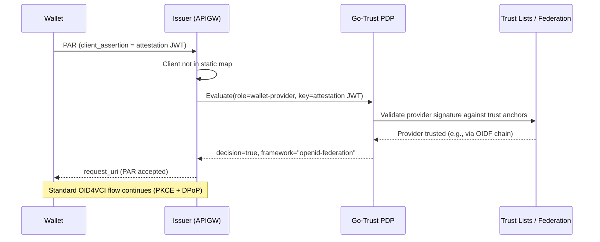

# Wallet Attestation

Wallet attestation enables credential issuers to authenticate wallets without pre-registering each wallet instance. Instead of maintaining a static client map, the issuer delegates the trust decision to the [Go-Trust PDP](./go-trust.md), which validates the wallet provider's identity against configured trust lists and federation anchors.

:::tip When to use this
Use wallet attestation when you want your issuer to accept credentials requests from **any wallet whose provider is trusted by your federation** — without manually registering each wallet deployment.
:::

## How It Works



### Security Model

The issuer relies on three complementary mechanisms:

| Mechanism | Purpose |
|-----------|---------|
| **PDP trust decision** | Authenticates the wallet provider (signature verification against trust lists) |
| **PKCE (S256)** | Binds the authorization code to the wallet that initiated the flow — prevents code interception |
| **DPoP** | Sender-constrains the access token to the wallet's key — prevents token theft |

No redirect URI allowlist is needed. PKCE ensures that only the party holding the `code_verifier` can redeem the authorization code, regardless of where the browser redirects.

## Configuration

### Issuer (APIGW)

```yaml
apigw:
  trust:
    pdp_url: "https://trust.siros.se/pdp"  # Required for attestation
  delivery:
    openid4vci:
      accept_wallet_attestation: true       # Enable attestation auth
      # Static clients map is still supported for backward compatibility
      clients:
        legacy-wallet:
          redirect_uri: "https://old-wallet.example.com/callback"
          scopes: [openid, pid]
```

### Go-Trust PDP

The PDP must have a registry that can validate wallet provider signatures. The wallet provider must be discoverable through one of go-trust's supported registries:

**Option A: OpenID Federation** (recommended for production)

The wallet provider publishes an entity configuration at `/.well-known/openid-federation`. The PDP resolves the trust chain from the provider back to a configured trust anchor:

```yaml
registries:
  oidfed:
    enabled: true
    trust_anchors:
      - entity_id: "https://federation.example.com"
    entity_types:
      - "openid_provider"       # issuers
      - "openid_relying_party"  # verifiers
      - "oauth_client"          # wallet providers
```

**Option B: Whitelist** (simple deployments / development)

For environments without federation, a static whitelist with a `wallet-provider` action mapping:

```yaml
registries:
  whitelist:
    enabled: true
    config_file: "/etc/go-trust/whitelist.yaml"
```

With the whitelist file:

```yaml
lists:
  wallet-providers:
    - "https://wallet-provider.siros.se"
    - "https://wallet-provider.other.eu"
actions:
  wallet-provider: "wallet-providers"
```

## WIA and Key Attestation

The SIROS ID Issuer supports **OAuth 2.0 Attestation-Based Client Authentication** ([draft-ietf-oauth-attestation-based-client-auth](https://www.ietf.org/archive/id/draft-ietf-oauth-attestation-based-client-auth-04.html)), which defines two complementary attestation types:

### Wallet Instance Attestation (WIA)

A WIA is a JWT signed by the **wallet provider** asserting that a specific wallet instance is genuine and meets the provider's security requirements. It answers: *"Is this wallet app authentic?"*

Per the spec (§3.1), the WIA contains:

| Claim | Description |
|-------|-------------|
| `iss` | Wallet provider identifier (e.g., `https://wallet-provider.siros.se`) |
| `sub` | Public key thumbprint of the wallet instance's key (RFC 7638) |
| `iat` | Issuance time |
| `exp` | Expiration time |
| `cnf.jwk` | The wallet instance's public key (the key this attestation binds to) |
| `aal` | (Optional) Authenticator assurance level |
| `attested_security_context` | (Optional) Device integrity context (e.g., Android Key Attestation, Apple App Attest) |

### Key Attestation (PoP)

The Key Attestation is a proof-of-possession JWT signed by the **wallet instance** using the key declared in `cnf.jwk` of the WIA. It answers: *"Does this wallet actually hold the attested key?"*

Per the spec (§3.2), the Key Attestation PoP contains:

| Claim | Description |
|-------|-------------|
| `iss` | Same as WIA's `sub` (the wallet instance's key thumbprint) |
| `aud` | The issuer's endpoint URL (PAR or token endpoint) |
| `iat` | Issuance time |
| `exp` | Expiration time |
| `jti` | Unique identifier (replay protection) |

### Wire Format

The two attestations are concatenated with `~` as the separator in the `client_assertion` parameter:

```
client_assertion = <WIA_JWT>~<Key_Attestation_PoP_JWT>
client_assertion_type = urn:ietf:params:oauth:client-assertion-type:jwt-client-attestation
```

This is used at the PAR endpoint (OID4VCI §6.2) and the token endpoint (OID4VCI §6.3).

## Where Attestation Is Used in OID4VCI

The OID4VCI specification ([OpenID4VCI §6](https://openid.net/specs/openid-4-verifiable-credential-issuance-1_0.html#section-6)) requires wallet authentication at two points:

| Endpoint | Purpose | Reference |
|----------|---------|-----------|
| **PAR** (`/op/par`) | Authenticate the wallet when pushing the authorization request | RFC 9126 §2, OID4VCI §6.2 |
| **Token** (`/token`) | Authenticate the wallet when exchanging the authorization code | RFC 6749 §4.1.3, OID4VCI §6.3 |

At both endpoints, the wallet presents `client_assertion_type` + `client_assertion` per [RFC 7523 §2.2](https://www.rfc-editor.org/rfc/rfc7523#section-2.2), using the attestation-specific type from the attestation-based-client-auth draft.

:::note PKCE and DPoP remain mandatory
Attestation authenticates the wallet (identity). PKCE binds the code (RFC 9126 §3). DPoP binds the token (RFC 9449). All three operate independently and are all required for public clients.
:::

## Trust Evaluation

The SIROS ID Issuer does **not** verify the WIA signature locally. Instead, it delegates the trust decision to the Go-Trust PDP:

1. Extract `iss` from the WIA (identifies the wallet provider)
2. Send the raw attestation to the PDP with `role=wallet-provider`
3. The PDP validates the wallet provider's signature against its configured trust registries (OIDF federation, trust lists, whitelists)
4. If the PDP returns `trusted: true`, the wallet is accepted

This means:
- Adding/removing trusted wallet providers is a **PDP registry operation** (federation onboarding, trust list update)
- The issuer never needs reconfiguration when wallet providers change
- The same PDP registries that validate issuers and verifiers also validate wallet providers

## Comparison with Static Client Registration

| Aspect | Static Client Map | Wallet Attestation |
|--------|-------------------|-------------------|
| **Adding a wallet** | Edit YAML config, redeploy | Wallet provider joins federation — no issuer change |
| **Security binding** | Redirect URI allowlist + PKCE | PKCE + DPoP (PDP validates provider) |
| **Scalability** | One entry per wallet deployment | Unlimited wallets per trusted provider |
| **Trust model** | Admin decision (manual) | Federation / trust list (automated) |
| **Offline operation** | Works without PDP | Requires PDP reachability |
| **Spec reference** | RFC 6749 §2.2 (static registration) | draft-ietf-oauth-attestation-based-client-auth |

## Related

- [Trust Services Overview](./index.md) — Supported trust frameworks
- [OpenID Federation](./openid-federation.md) — How to join a federation as a wallet provider
- [Go-Trust](./go-trust.md) — PDP configuration and registry setup
