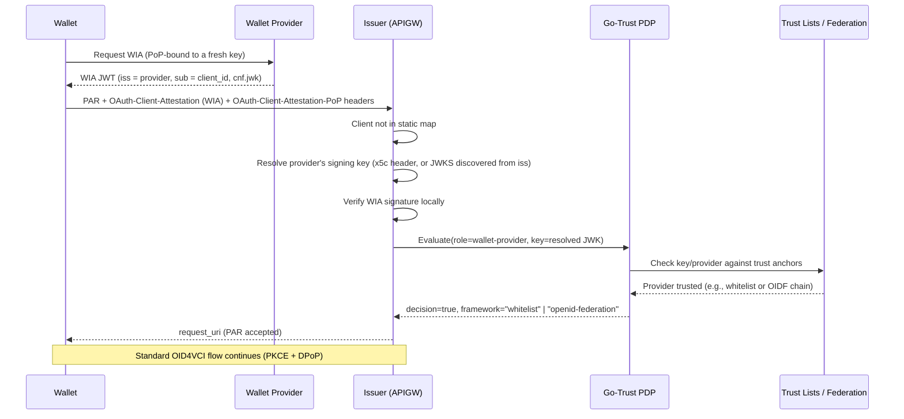

# Wallet Attestation

Wallet attestation enables credential issuers to authenticate wallets without pre-registering each wallet instance. Instead of maintaining a static client map, the issuer's own APIGW verifies a **wallet-provider-signed attestation JWT**, then delegates only the *trust decision* (is this provider trusted?) to the [Go-Trust PDP](./go-trust.md).

:::tip When to use this
Use wallet attestation when you want your issuer to accept credential requests from **any wallet whose provider is trusted by your federation** — without manually registering each wallet deployment.
:::

For a practical, step-by-step setup, see the [Attestation-Based Authentication how-to](../../howto/attestation-based-authentication.md).

## How It Works


```mermaid
sequenceDiagram
    participant W as Wallet
    participant WP as Wallet Provider
    participant I as Issuer (APIGW)
    participant PDP as Go-Trust PDP
    participant TL as Trust Lists / Federation

    W->>WP: Request WIA (PoP-bound to a fresh key)
    WP-->>W: WIA JWT (iss = provider, sub = client_id, cnf.jwk)
    W->>I: PAR + OAuth-Client-Attestation (WIA) + OAuth-Client-Attestation-PoP headers
    I->>I: Client not in static map
    I->>I: Resolve provider's signing key (x5c header, or JWKS discovered from iss)
    I->>I: Verify WIA signature locally
    I->>PDP: Evaluate(role=wallet-provider, key=resolved JWK)
    PDP->>TL: Check key/provider against trust anchors
    TL-->>PDP: Provider trusted (e.g., whitelist or OIDF chain)
    PDP-->>I: decision=true, framework="whitelist" | "openid-federation"
    I-->>W: request_uri (PAR accepted)
    Note over W,I: Standard OID4VCI flow continues (PKCE + DPoP)
```

### Security Model

The issuer relies on four complementary mechanisms:

| Mechanism | Purpose | Who performs it |
|-----------|---------|------------------|
| **Local signature verification** | Confirms the WIA was actually signed by the key its provider claims | The issuer itself (APIGW), *before* any PDP call |
| **PDP trust decision** | Confirms that resolved key/provider is one the federation trusts | Go-Trust PDP, on already-verified key material |
| **PKCE (S256)** | Binds the authorization code to the wallet that initiated the flow — prevents code interception | Standard OAuth |
| **DPoP** | Sender-constrains the access token to the wallet's key — prevents token theft | Standard OAuth |

:::danger The PDP never verifies signatures — it only makes trust decisions
This is a load-bearing security property, not an implementation detail: the PDP's registries (whitelist, OpenID Federation, DID) expect a **resolved key** (a JWK), never a raw, unverified JWT string. Signature verification is the *caller's* responsibility — for SUNET/vc's APIGW, that's the shared `JWTTrustVerifier` used for issuer/verifier trust too. An earlier implementation skipped this and forwarded the raw WIA string straight to the PDP; for `iss`-based (no `x5c`) attestations this meant registry code received a JWT string where it expected a JWK. Any future PDP client that skips local verification and delegates to the PDP will reproduce that gap.
:::

No redirect URI allowlist is needed. PKCE ensures that only the party holding the `code_verifier` can redeem the authorization code, regardless of where the browser redirects.

## Configuration

### Issuer (SUNET/vc APIGW)

```yaml
apigw:
  trust:
    pdp_url: "https://trust.siros.se/pdp"    # Required - also gates whether attestation is checked at all
    wallet_attestation:
      enabled: true                           # Enable attestation-based client auth
      policy:                                 # Optional: SPOCP-based per-scope tiering
        rules:
          - "(wallet (attestation_source ios_app_attest)(scope pid)(issuer *))"
  delivery:
    openid4vci:
      clients:                                # Static map still works as a fallback for legacy wallets
        legacy-wallet:
          redirect_uri: "https://old-wallet.example.com/callback"
          scopes: [openid, pid]
```

`wallet_attestation.enabled` only takes effect when `trust.pdp_url` is also set — the PDP performs the trust/registry decision, never the signature check. Leaving `policy` unset means "default open": any wallet provider the PDP trusts is authorized for **any** scope, with no additional per-scope gating.

### Wallet Provider (e.g. go-wallet-backend)

The wallet provider issues WIAs and must publish its signing key somewhere the issuer's JWKS discovery can find it:

```yaml
wallet_provider:
  wia:
    enabled: true
    issuer: "https://wallet-provider.siros.se"
    omit_x5c: true    # false (default): x5c chain embedded in the WIA header instead
```

- **`omit_x5c: false` (default)** — the WIA carries an `x5c` certificate chain in its JOSE header; relying parties treat the embedded cert as authoritative, and `iss` (if present) is only a secondary consistency check.
- **`omit_x5c: true`** — no certificate chain. This is the *only* way to actually exercise `iss`/JWKS-based trust (the IETF draft's second identity format) — with a cert configured but `omit_x5c: false`, consumers use the cert regardless of `iss`. Requires `issuer` to be set; the provider publishes its key at `<issuer>/.well-known/jwks.json`, keyed by a JOSE `kid` header the WIA itself also carries (`"wallet-provider"`).

### Go-Trust PDP

The PDP must have a registry that can validate the **resolved key/provider identity** — never a raw JWT. The wallet provider must be discoverable through one of go-trust's supported registries:

**Option A: OpenID Federation** (recommended for production)

The wallet provider publishes an entity configuration at `/.well-known/openid-federation`. The PDP resolves the trust chain from the provider back to a configured trust anchor:

```yaml
registries:
  oidfed:
    enabled: true
    trust_anchors:
      - entity_id: "https://federation.example.com"
    entity_types:
      - "openid_provider"       # issuers
      - "openid_relying_party"  # verifiers
      - "oauth_client"          # wallet providers
```

**Option B: Whitelist** (simple deployments / development)

For environments without federation, a static whitelist with a `wallet_provider` action mapping:

```yaml
registries:
  whitelist:
    enabled: true
    config_file: "/etc/go-trust/whitelist.yaml"
```

With the whitelist file:

```yaml
lists:
  wallet-providers:
    - "https://wallet-provider.siros.se"
    - "https://wallet-provider.other.eu"
actions:
  wallet_provider: "wallet-providers"
```

## WIA and Key Attestation

The SIROS ID Issuer supports **OAuth 2.0 Attestation-Based Client Authentication** ([draft-ietf-oauth-attestation-based-client-auth](https://www.ietf.org/archive/id/draft-ietf-oauth-attestation-based-client-auth-10.html)), which defines two complementary attestation types.

### Wallet Instance Attestation (WIA)

A WIA is a JWT signed by the **wallet provider** asserting that a specific wallet instance is genuine and meets the provider's security requirements. It answers: *"Is this wallet app authentic?"*

Per the spec (§3.1), the WIA contains:

| Claim | Description |
|-------|-------------|
| `iss` | Wallet provider identifier (e.g., `https://wallet-provider.siros.se`) |
| `sub` | **The OAuth `client_id` the wallet is using for this flow** — not a key thumbprint. For an unregistered client this is typically the wallet's own `redirect_uri` (OID4VCI §7.1 convention). The issuer rejects the attestation if this doesn't match the `client_id` it independently resolves for the same request. |
| `iat` | Issuance time |
| `exp` | Expiration time |
| `cnf.jwk` | The wallet instance's public key (the key this attestation binds to) |
| `aal` | (Optional) Authenticator assurance level |
| `attested_security_context` | (Optional) Device integrity context (e.g., Android Key Attestation, Apple App Attest) |

:::note A real integration bug worth knowing about
`sub` must equal whatever `client_id` value ends up on the actual PAR/token request — not the credential issuer's own URL, and not a key thumbprint. Getting this wrong produces a clean, specific rejection (`wallet attestation subject does not match client_id`), which is how the SIROS ID reference integration caught it.
:::

### Key Attestation (PoP)

The Key Attestation is a proof-of-possession JWT signed by the **wallet instance** using the key declared in `cnf.jwk` of the WIA. It answers: *"Does this wallet actually hold the attested key?"*

Per the spec (§3.2), the Key Attestation PoP contains:

| Claim | Description |
|-------|-------------|
| `iss` | Same as WIA's `sub` (the wallet's `client_id`) |
| `aud` | **The credential issuer's endpoint** (PAR or token URL) — *not* the wallet provider. A separate PoP with a different audience is used when requesting the WIA itself from the wallet provider; the two must never be confused. |
| `iat` | Issuance time |
| `exp` | Expiration time |
| `jti` | Unique identifier (replay protection) |

### Wire Format

The two attestations are sent as **separate HTTP headers**, per the current draft:

```
OAuth-Client-Attestation: <WIA_JWT>
OAuth-Client-Attestation-PoP: <Key_Attestation_PoP_JWT>
```

This is used at the PAR endpoint (OID4VCI §6.2) and the token endpoint (OID4VCI §6.3). A form-body `client_assertion` (single value, `~`-concatenated) appears in older draft revisions and some other implementations' legacy fallback paths — new integrations should use the HTTP header form.

## Where Attestation Is Used in OID4VCI

The OID4VCI specification ([OpenID4VCI §6](https://openid.net/specs/openid-4-verifiable-credential-issuance-1_0.html#section-6)) requires wallet authentication at two points:

| Endpoint | Purpose | Reference |
|----------|---------|-----------|
| **PAR** (`/op/par`) | Authenticate the wallet when pushing the authorization request | RFC 9126 §2, OID4VCI §6.2 |
| **Token** (`/token`) | Authenticate the wallet when exchanging the authorization code | RFC 6749 §4.1.3, OID4VCI §6.3 |

At both endpoints, the wallet presents the two attestation headers above.

:::note PKCE and DPoP remain mandatory
Attestation authenticates the wallet (identity). PKCE binds the code (RFC 9126 §3). DPoP binds the token (RFC 9449). All three operate independently and are all required for public clients.
:::

## Trust Evaluation

The SIROS ID Issuer verifies the WIA's signature **itself**, locally, before ever calling the PDP:

1. Extract `iss` from the WIA (identifies the wallet provider) and resolve its signing key — from the WIA's own `x5c` header, or, for `iss`-based (no `x5c`) attestations, by discovering the provider's JWKS from `iss` (tries, in order: `.well-known/jwt-vc-issuer`, `.well-known/openid-credential-issuer`, `.well-known/openid-configuration`, `.well-known/oauth-authorization-server` — the first that resolves wins)
2. Verify the WIA's signature against that key
3. Send the **resolved key**, not the raw token, to the PDP with `role=wallet-provider`
4. The PDP checks that key/provider against its configured trust registries (OIDF federation, trust lists, whitelists) — a pure membership/trust decision, no cryptographic verification
5. If the PDP returns `trusted: true`, the wallet is accepted

This means:
- Adding/removing trusted wallet providers is a **PDP registry operation** (federation onboarding, trust list update)
- The issuer never needs reconfiguration when wallet providers change
- The same PDP registries that validate issuers and verifiers also validate wallet providers
- Signature verification and trust evaluation are **separate steps performed by separate components** — never combine them into one call

## Comparison with Static Client Registration

| Aspect | Static Client Map | Wallet Attestation |
|--------|-------------------|-------------------|
| **Adding a wallet** | Edit YAML config, redeploy | Wallet provider joins federation/trust list — no issuer change |
| **Security binding** | Redirect URI allowlist + PKCE | Local signature check + PDP trust decision + PKCE + DPoP |
| **Scalability** | One entry per wallet deployment | Unlimited wallets per trusted provider |
| **Trust model** | Admin decision (manual) | Federation / trust list (automated) |
| **Offline operation** | Works without PDP | Requires PDP reachability |
| **Spec reference** | RFC 6749 §2.2 (static registration) | draft-ietf-oauth-attestation-based-client-auth |

## Related

- [Attestation-Based Authentication (how-to)](../../howto/attestation-based-authentication.md) — a concrete, worked deployment example
- [Trust Services Overview](./index.md) — Supported trust frameworks
- [OpenID Federation](./openid-federation.md) — How to join a federation as a wallet provider
- [Go-Trust](./go-trust.md) — PDP configuration and registry setup
