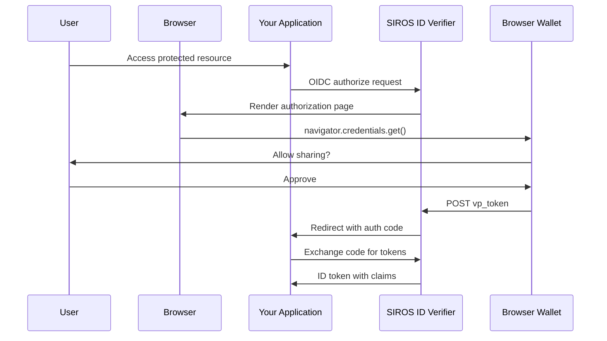
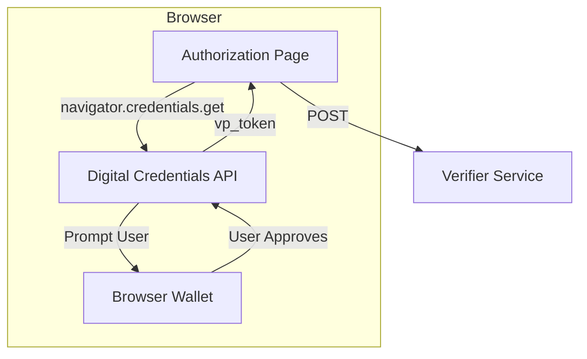

# W3C Digital Credentials API

The SIROS ID verifier supports the **W3C Digital Credentials API** for browser-based credential presentation. This modern approach allows users to present digital credentials directly from their browser's built-in wallet, providing a seamless user experience without requiring QR code scanning.

## Overview

The [W3C Digital Credentials API](https://wicg.github.io/digital-credentials/) is a browser API that enables web applications to request verifiable credentials from digital wallets. It provides:

- **Native browser integration** – No separate wallet app required for some flows
- **Improved UX** – Present credentials with a single click
- **Strong security** – Browser-mediated credential exchange
- **Format flexibility** – Supports SD-JWT and mdoc formats



## Configuration

Enable the Digital Credentials API in your verifier configuration:

```yaml
verifier:
  digital_credentials:
    # Enable W3C Digital Credentials API
    enable: true
    
    # Serve signed request objects (JAR). Must be true for the browser flow,
    # see the caution below
    use_jar: true
    
    # Credential format preference order
    preferred_formats:
      - "vc+sd-jwt"
      - "dc+sd-jwt"
      - "mso_mdoc"
    
    # Fallback to QR code if DC API unavailable
    allow_qr_fallback: true
    
    # Deep link scheme for mobile wallets
    deep_link_scheme: "openid4vp://"
```

### Configuration Options

| Option | Type | Default | Description |
|--------|------|---------|-------------|
| `enable` | boolean | `false` | Enable W3C Digital Credentials API support (note: `enable`, not `enabled`) |
| `use_jar` | boolean | `false` | Serve the request as a signed JWT (JAR). Required for the browser flow, see below |
| `preferred_formats` | array | `["vc+sd-jwt", "dc+sd-jwt", "mso_mdoc"]` | Credential formats in preference order |
| `allow_qr_fallback` | boolean | `true` | Auto-fallback to QR if DC API unavailable |
| `auto_attempt` | boolean | `true` | Whether the presentation UI calls `navigator.credentials.get()` immediately, before showing the same-device wallet link/QR screen. Set `false` to skip straight to that fallback screen — useful because some OS-level DC API matchers reject a non-standard format (e.g. `mso_mdoc_zk`) with their own dialog, with no JS-catchable failure to fall back from. |
| `deep_link_scheme` | string | *(none)* | Deep link scheme for mobile wallets, e.g. `"eudi-wallet://"` — no built-in default; unset means no deep-link option is offered |

### Response Modes

The response mode of a request object is chosen by the verifier, not set per
feature:

- For requests issued through the OIDC `/authorize` flow, the mode is
  `direct_post.jwt` (encrypted) or `direct_post`. Set
  `verifier.inbound.openid4vp.response_mode` to choose between them. If it is
  unset, the mode is derived from `digital_credentials.response_mode` (default
  `dc_api.jwt`), with a `dc_api` mode mapped to the equivalent `direct_post`
  mode so that encryption is preserved. A `dc_api` mode is never put in a link
  or QR request.
- The verifier's own interactive UI (the preset pages) additionally issues a
  separate `dc_api.jwt` request object for `navigator.credentials.get()`.

:::caution `use_jar: false` breaks the browser wallet button
With `use_jar: false` the authorization page requests the unsigned request
object from `/verification/request/{session_id}`, which the verifier does not
serve, so the "browser wallet" action fails with a 404. Currently the browser
flow only works with `use_jar: true`.

Known issue: https://github.com/SUNET/vc/issues/755
:::

### Supported Credential Formats

| Format | Description |
|--------|-------------|
| `vc+sd-jwt` | SD-JWT Verifiable Credentials (W3C standard) |
| `dc+sd-jwt` | Digital Credentials SD-JWT variant |
| `mso_mdoc` | ISO/IEC 18013-5 mobile document format |

## Browser Support

The Digital Credentials API is implemented by recent Chromium-based browsers and
by Safari; support and the protocols it allows differ by browser and operating
system version, and change quickly, so check the current status for your target
browsers. The verifier's page requires the browser to allow the signed OpenID4VP
protocol (`openid4vp-v1-signed`); otherwise it behaves as if the API were
unavailable.

When a browser doesn't support the Digital Credentials API (or the required
protocol) and `allow_qr_fallback` is enabled, the verifier automatically falls
back to the QR code / same-device link flow. Set `auto_attempt: false` to skip
the native call and always show that screen first.

## How It Works

### For Relying Parties

**No changes required** – RPs use the standard OIDC authorization code flow. The verifier handles all wallet interactions:

```javascript
// Standard OIDC request - no special handling needed
const authUrl = new URL('https://verifier.example.org/authorize');
authUrl.searchParams.set('response_type', 'code');
authUrl.searchParams.set('client_id', 'your-client-id');
authUrl.searchParams.set('redirect_uri', 'https://your-app.com/callback');
authUrl.searchParams.set('scope', 'openid pid');
authUrl.searchParams.set('state', generateState());
// PKCE is required for clients registered through /register
authUrl.searchParams.set('code_challenge', generatePKCE());
authUrl.searchParams.set('code_challenge_method', 'S256');

window.location = authUrl.toString();
```

### Browser Flow

When a user visits the authorization page in a supported browser:

1. The verifier renders an authorization page with embedded JavaScript (using the `@sirosfoundation/dc-api` library)
2. The JavaScript calls `navigator.credentials.get()` with the presentation request
3. The browser's credential UI prompts the user to select and share credentials
4. The wallet returns the credential presentation to the verifier
5. The verifier verifies the presentation and issues tokens to the RP



## UI Customization

Customize the authorization page appearance:

```yaml
verifier:
  authorization_page_css:
    # Predefined theme: light, dark, blue, purple
    theme: "light"
    
    # Custom brand colors
    primary_color: "#667eea"
    secondary_color: "#764ba2"
    
    # Custom logo
    logo_url: "https://your-app.com/logo.png"
    
    # Page text
    title: "Wallet Authorization"
    subtitle: "Share your credentials securely"
    
    # Custom CSS (inline)
    custom_css: |
      .auth-container { border-radius: 12px; }
    
    # Or a stylesheet URL, emitted as a <link href>. It is not served by the
    # verifier: host it yourself (for example on your own web server)
    css_file: "https://your-app.com/custom-auth.css"
```

## Credential Display

Optionally show users the credentials being shared before completing authorization:

```yaml
verifier:
  credential_display:
    # Enable credential preview
    enable: true
    
    # Require user to review credentials
    require_confirmation: false
    
    # Show raw credential data (for debugging)
    show_raw_credential: false
    
    # Show parsed claims being sent to RP
    show_claims: true
```

## Complete Example

This configuration passes the verifier's startup validation. The
`credential_metadata` files, the signing key and certificate chain, and the
secrets file are described in [Verifier Configuration](./verifier#verifier-configuration).

```yaml
common:
  mongo:
    uri: mongodb://mongo:27017
  production: true
  secret_file_path: "/etc/vc/secrets.yaml"
  credential_metadata:
    pid:
      vctm_file_path: "/metadata/vctm_pid.json"
      format: "dc+sd-jwt"

verifier:
  api_server:
    addr: :8080
    trust_proxy_tls: true
  public_url: "https://verifier.example.org"

  key_config:
    private_key_path: "/pki/signing_key.pem"
    chain_path: "/pki/signing_chain.pem"

  inbound:
    openid4vp:
      token_endpoint: "https://verifier.example.org/token"
      supported_credentials:
        - vct: "urn:eudi:pid:1"
          scopes: ["pid"]
      clients:
        "default":
          type: "public"
          redirect_uri: "https://verifier.example.org/"
          scopes: ["pid"]

  outbound:
    oidc_provider:
      issuer: "https://verifier.example.org"
      code_duration: 300
      access_token_duration: 3600
      id_token_duration: 3600
      subject_type: "pairwise"
      subject_salt: "set-in-secrets-file"

  # Required for production; omit only for development and testing
  trust:
    pdp_url: "http://go-trust:6001"

  digital_credentials:
    enable: true
    use_jar: true
    preferred_formats:
      - "vc+sd-jwt"
      - "dc+sd-jwt"
    allow_qr_fallback: true

  authorization_page_css:
    theme: "light"
    logo_url: "https://your-org.com/logo.png"
    title: "Sign in with Your Credential"
```

:::danger A PDP is required for production
`verifier.trust.pdp_url` must point at an AuthZEN PDP such as
[go-trust](../trust/go-trust). Without it the verifier trusts every issuer and
resolves only `did:key` and `did:jwk` locally. That mode may work for some
things but is not supported: development and testing only.
:::

## Security Considerations

1. **Use JAR**: Keep `use_jar: true`; request objects are signed and the browser flow needs it
2. **Encrypted responses**: Set `verifier.inbound.openid4vp.response_mode: "direct_post.jwt"` so wallet responses are encrypted to the verifier
3. **Verify origins**: The browser verifies the requesting origin automatically
4. **Trust framework**: A PDP is required for production. Configure [Go-Trust](../trust/go-trust) and set `verifier.trust.pdp_url`; without it every issuer is trusted

## Troubleshooting

### DC API Not Detected

**Symptoms:** Falls back to QR code on supported browsers

**Solutions:**
1. Ensure HTTPS is used (required for Credential API)
2. Ensure `digital_credentials.enable` is `true` (the key is `enable`, not `enabled`; an unknown key is silently ignored) and `use_jar` is `true`
3. Check the browser supports the API and allows the `openid4vp-v1-signed` protocol
4. Verify no browser extensions are blocking the API

### Credential Not Accepted

**Solutions:**
1. Verify credential format is in `preferred_formats`
2. Check credential VCT matches `supported_credentials` and the template's `vct_values`
3. Ensure issuer is trusted via trust configuration

## Next Steps

- [Verifier Configuration](./verifier) – Full verifier options
- [Trust Services](../trust/) – Configure issuer trust
- [OIDC RP Integration](./oidc-rp) – Standard OIDC integration
