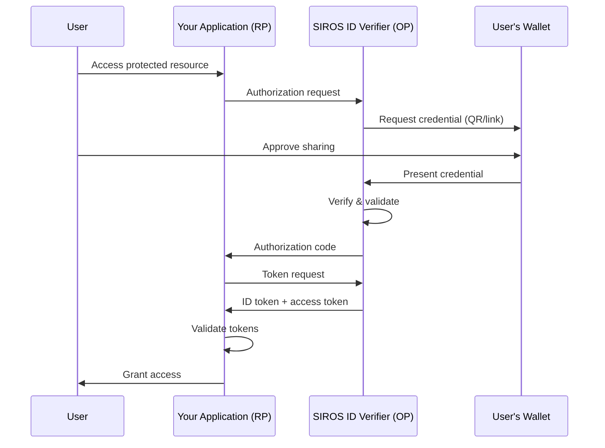

# OpenID Connect Relying Party Integration

This guide explains how to integrate the SIROS ID verifier with any application using standard [OpenID Connect](https://openid.net/specs/openid-connect-core-1_0.html). After reading this guide, you will understand how to:

- Add SIROS ID as an OpenID Connect provider for your application
- Configure authentication requests
- Handle ID tokens and claims
- Implement the [authorization code flow with PKCE](https://datatracker.ietf.org/doc/html/rfc7636)

## Overview

The SIROS ID verifier acts as an OpenID Connect Provider (OP). Your application connects as a Relying Party (RP), receiving verified credential claims through standard OIDC tokens.



:::tip When to Use Direct OIDC
Use direct OIDC integration when:
- You're not using an IAM platform (Keycloak, Auth0, etc.)
- You want full control over the authentication flow
- You're building a single-page application (SPA) or mobile app
:::

## Prerequisites

- An application that supports OIDC authentication
- A SIROS ID verifier (hosted or self-hosted)
- Basic understanding of OAuth 2.0 / OIDC flows

## Step 1: Register Your Application

Register your application with the verifier using dynamic client registration.

### Dynamic Registration

```bash
curl -X POST "https://verifier.example.org/register" \
  -H "Content-Type: application/json" \
  -d '{
    "client_name": "My Application",
    "redirect_uris": [
      "https://my-app.example.com/callback"
    ],
    "grant_types": ["authorization_code"],
    "response_types": ["code"],
    "token_endpoint_auth_method": "client_secret_post",
    "scope": "openid pid ehic"
  }'
```

The `scope` string is the list of scopes this client may request later. It
defaults to `openid` only, and any scope you request at `/authorize` that is not
listed here is rejected with `invalid_scope`. Register every scope you will use,
and use scopes that exist on your verifier (see
[Step 4](#step-4-request-credentials-via-scopes)).

Response:

```json
{
  "client_id": "abc123xyz",
  "client_secret": "secret456",
  "client_id_issued_at": 1704067200,
  "client_secret_expires_at": 0,
  "redirect_uris": ["https://my-app.example.com/callback"],
  "grant_types": ["authorization_code"],
  "response_types": ["code"],
  "token_endpoint_auth_method": "client_secret_post",
  "scope": "openid pid ehic",
  "registration_access_token": "...",
  "registration_client_uri": "https://verifier.example.org/register/abc123xyz"
}
```

The registration access token lets you read, update (`PUT`) or delete the
registration at `registration_client_uri` ([RFC 7592](https://datatracker.ietf.org/doc/html/rfc7592)).

:::caution Use `client_secret_post`
The registration default is `client_secret_basic`, and discovery advertises it,
but the token endpoint currently reads `client_id` and `client_secret` only from
the form body and does not parse an HTTP `Authorization: Basic` header. Register
with `client_secret_post`, and configure your OIDC library to send the client
credentials in the request body (the examples below show how).

Known issue: https://github.com/SUNET/vc/issues/758
:::

Refresh tokens are not implemented: only the `authorization_code` grant is
supported and no `refresh_token` is ever returned. Known issue: https://github.com/SUNET/vc/issues/759

### Public Clients (SPAs, Mobile Apps)

For applications that cannot keep secrets:

```bash
curl -X POST "https://verifier.example.org/register" \
  -H "Content-Type: application/json" \
  -d '{
    "client_name": "My SPA",
    "redirect_uris": ["https://my-spa.example.com/callback"],
    "grant_types": ["authorization_code"],
    "response_types": ["code"],
    "token_endpoint_auth_method": "none",
    "scope": "openid pid",
    "application_type": "web"
  }'
```

A browser application calls `/token`, `/jwks` and `/register` cross-origin, which
works only if the verifier operator has listed its origin under
`verifier.api_server.cors.allowed_origins`.

### PKCE

Every client registered through `/register`, public or confidential, must use
PKCE with `S256`: an `/authorize` request without a `code_challenge` fails with
`invalid_request`. (Clients declared statically in the verifier's configuration
are not subject to this; known issue: https://github.com/SUNET/vc/issues/757.)

## Step 2: Discover Endpoints

Fetch the OpenID Connect discovery document:

```bash
curl "https://verifier.example.org/.well-known/openid-configuration"
```

Response:

```json
{
  "issuer": "https://verifier.example.org",
  "authorization_endpoint": "https://verifier.example.org/authorize",
  "token_endpoint": "https://verifier.example.org/token",
  "userinfo_endpoint": "https://verifier.example.org/userinfo",
  "jwks_uri": "https://verifier.example.org/jwks",
  "registration_endpoint": "https://verifier.example.org/register",
  "response_types_supported": ["code", "id_token", "token id_token"],
  "subject_types_supported": ["public", "pairwise"],
  "id_token_signing_alg_values_supported": ["RS256", "ES256"],
  "scopes_supported": ["openid", "profile", "email", "pid", "ehic"],
  "claims_supported": ["sub", "name", "given_name", "family_name", "email", "email_verified", "birthdate", "address"],
  "grant_types_supported": ["authorization_code"],
  "code_challenge_methods_supported": ["S256"],
  "token_endpoint_auth_methods_supported": ["client_secret_basic", "client_secret_post", "none"]
}
```

The values shown are illustrative: `scopes_supported` lists `openid`, `profile`,
`email` plus the scopes the operator configured, and `userinfo_endpoint` is
present when the operator has `enable_userinfo` on (the default). Only the
authorization code flow (`response_type=code`) works, and
`client_secret_basic` is advertised but not honoured (see above).

## Step 3: Implement Authorization Code Flow

### Generate PKCE Parameters

```javascript
// Generate code verifier (43-128 characters)
function generateCodeVerifier() {
  const array = new Uint8Array(32);
  crypto.getRandomValues(array);
  return base64UrlEncode(array);
}

// Generate code challenge
async function generateCodeChallenge(verifier) {
  const encoder = new TextEncoder();
  const data = encoder.encode(verifier);
  const hash = await crypto.subtle.digest('SHA-256', data);
  return base64UrlEncode(new Uint8Array(hash));
}

function base64UrlEncode(buffer) {
  return btoa(String.fromCharCode(...buffer))
    .replace(/\+/g, '-')
    .replace(/\//g, '_')
    .replace(/=+$/, '');
}
```

### Build Authorization URL

```javascript
async function startAuthentication() {
  // Generate PKCE
  const codeVerifier = generateCodeVerifier();
  const codeChallenge = await generateCodeChallenge(codeVerifier);
  
  // Store verifier for token exchange
  sessionStorage.setItem('code_verifier', codeVerifier);
  
  // Generate state for CSRF protection
  const state = generateCodeVerifier();
  sessionStorage.setItem('oauth_state', state);
  
  // Build authorization URL
  const params = new URLSearchParams({
    response_type: 'code',
    client_id: 'your-client-id',
    redirect_uri: 'https://my-app.example.com/callback',
    scope: 'openid pid',
    state: state,
    code_challenge: codeChallenge,
    code_challenge_method: 'S256'
  });
  
  // Redirect to verifier
  window.location.href = `https://verifier.example.org/authorize?${params}`;
}
```

### Handle Callback

```javascript
async function handleCallback() {
  const params = new URLSearchParams(window.location.search);
  
  // Verify state
  const state = params.get('state');
  const savedState = sessionStorage.getItem('oauth_state');
  if (state !== savedState) {
    throw new Error('State mismatch - possible CSRF attack');
  }
  
  // Check for errors
  const error = params.get('error');
  if (error) {
    throw new Error(`Authentication failed: ${error}`);
  }
  
  // Exchange code for tokens
  const code = params.get('code');
  const codeVerifier = sessionStorage.getItem('code_verifier');
  
  const tokenResponse = await fetch('https://verifier.example.org/token', {
    method: 'POST',
    headers: {
      'Content-Type': 'application/x-www-form-urlencoded'
    },
    body: new URLSearchParams({
      grant_type: 'authorization_code',
      code: code,
      redirect_uri: 'https://my-app.example.com/callback',
      client_id: 'your-client-id',
      code_verifier: codeVerifier
    })
  });
  
  const tokens = await tokenResponse.json();
  
  // Clean up
  sessionStorage.removeItem('code_verifier');
  sessionStorage.removeItem('oauth_state');
  
  return tokens;
}
```

### Validate ID Token

```javascript
async function validateIdToken(idToken) {
  // Fetch JWKS
  const jwksResponse = await fetch('https://verifier.example.org/jwks');
  const jwks = await jwksResponse.json();
  
  // Parse token header to find key
  const [headerB64] = idToken.split('.');
  const header = JSON.parse(atob(headerB64));
  const key = jwks.keys.find(k => k.kid === header.kid);
  
  // Import key and verify signature. The algorithm follows header.alg
  // (ES256 or RS256, depending on the verifier's signing key): use
  // { name: 'ECDSA', namedCurve: 'P-256' } for ES256, or
  // { name: 'RSASSA-PKCS1-v1_5', hash: 'SHA-256' } for RS256.
  const publicKey = await crypto.subtle.importKey(
    'jwk',
    key,
    { name: 'ECDSA', namedCurve: 'P-256' },
    false,
    ['verify']
  );
  
  // ... signature verification ...
  
  // Parse and validate claims
  const [, payloadB64] = idToken.split('.');
  const claims = JSON.parse(atob(payloadB64));
  
  // Validate issuer
  if (claims.iss !== 'https://verifier.example.org') {
    throw new Error('Invalid issuer');
  }
  
  // Validate audience
  if (claims.aud !== 'your-client-id') {
    throw new Error('Invalid audience');
  }
  
  // Validate expiration
  if (claims.exp < Date.now() / 1000) {
    throw new Error('Token expired');
  }
  
  return claims;
}
```

## Step 4: Request Credentials via Scopes

The scopes you request control which credentials the verifier asks the wallet
for. There is no fixed list: the available credential scopes are whatever the
verifier operator configured, and discovery's `scopes_supported` shows them.
A scope is accepted when

1. it is in the scopes you registered for your client (Step 1), and
2. it selects a credential on the verifier, either through a
   presentation-request template's `oidc_scopes` or as a key of the verifier's
   `common.credential_metadata`.

`openid` is the base scope. The examples below use `pid` and `ehic`, which exist
on a verifier configured as in [Verifier Configuration](./verifier).

### Example: Request PID and EHIC

```javascript
const params = new URLSearchParams({
  response_type: 'code',
  client_id: 'your-client-id',
  redirect_uri: 'https://my-app.example.com/callback',
  scope: 'openid pid ehic',  // must all have been registered in Step 1
  state: state,
  code_challenge: codeChallenge,
  code_challenge_method: 'S256'
});
```

## Language-Specific Examples

### Node.js (Express)

```javascript
const express = require('express');
const { Issuer, generators } = require('openid-client');

const app = express();

let client;

async function initializeClient() {
  const issuer = await Issuer.discover('https://verifier.example.org');
  client = new issuer.Client({
    client_id: 'your-client-id',
    client_secret: 'your-client-secret',
    redirect_uris: ['http://localhost:3000/callback'],
    response_types: ['code'],
    // The verifier reads client credentials from the request body only
    token_endpoint_auth_method: 'client_secret_post'
  });
}

app.get('/login', (req, res) => {
  const codeVerifier = generators.codeVerifier();
  const codeChallenge = generators.codeChallenge(codeVerifier);
  const state = generators.state();
  
  req.session.codeVerifier = codeVerifier;
  req.session.state = state;
  
  const authUrl = client.authorizationUrl({
    scope: 'openid pid',
    state: state,
    code_challenge: codeChallenge,
    code_challenge_method: 'S256'
  });
  
  res.redirect(authUrl);
});

app.get('/callback', async (req, res) => {
  const params = client.callbackParams(req);
  const tokenSet = await client.callback(
    'http://localhost:3000/callback',
    params,
    {
      code_verifier: req.session.codeVerifier,
      state: req.session.state
    }
  );
  
  const claims = tokenSet.claims();
  req.session.user = claims;
  res.redirect('/');
});
```

### Python (Flask)

```python
from flask import Flask, redirect, session, url_for
from authlib.integrations.flask_client import OAuth

app = Flask(__name__)
app.secret_key = 'your-secret-key'

oauth = OAuth(app)
oauth.register(
    name='sirosid',
    client_id='your-client-id',
    client_secret='your-client-secret',
    server_metadata_url='https://verifier.example.org/.well-known/openid-configuration',
    client_kwargs={
        'scope': 'openid pid',
        # The verifier reads client credentials from the request body only,
        # and requires PKCE for registered clients
        'token_endpoint_auth_method': 'client_secret_post',
        'code_challenge_method': 'S256',
    }
)

@app.route('/login')
def login():
    redirect_uri = url_for('callback', _external=True)
    return oauth.sirosid.authorize_redirect(redirect_uri)

@app.route('/callback')
def callback():
    token = oauth.sirosid.authorize_access_token()
    user = token.get('userinfo')
    session['user'] = user
    return redirect('/')
```

### Go

```go
package main

import (
    "context"
    "github.com/coreos/go-oidc/v3/oidc"
    "golang.org/x/oauth2"
)

func main() {
    ctx := context.Background()
    
    provider, _ := oidc.NewProvider(ctx, "https://verifier.example.org")
    
    oauth2Config := oauth2.Config{
        ClientID:     "your-client-id",
        ClientSecret: "your-client-secret",
        RedirectURL:  "http://localhost:8080/callback",
        // Send client credentials in the body, not an Authorization header
        Endpoint: oauth2.Endpoint{
            AuthURL:   provider.Endpoint().AuthURL,
            TokenURL:  provider.Endpoint().TokenURL,
            AuthStyle: oauth2.AuthStyleInParams,
        },
        Scopes:       []string{oidc.ScopeOpenID, "pid"},
    }
    
    verifier := provider.Verifier(&oidc.Config{ClientID: "your-client-id"})
    
    // Login handler
    http.HandleFunc("/login", func(w http.ResponseWriter, r *http.Request) {
        state := generateState()
        // Store state and the PKCE verifier in the session
        pkceVerifier := oauth2.GenerateVerifier()
        http.Redirect(w, r,
            oauth2Config.AuthCodeURL(state, oauth2.S256ChallengeOption(pkceVerifier)),
            http.StatusFound)
    })
    
    // Callback handler
    http.HandleFunc("/callback", func(w http.ResponseWriter, r *http.Request) {
        // Verify state
        code := r.URL.Query().Get("code")
        
        // pkceVerifier is the value stored in the session at login
        token, _ := oauth2Config.Exchange(ctx, code, oauth2.VerifierOption(pkceVerifier))
        rawIDToken, _ := token.Extra("id_token").(string)
        idToken, _ := verifier.Verify(ctx, rawIDToken)
        
        var claims map[string]interface{}
        idToken.Claims(&claims)
        
        // Use claims...
    })
}
```

### Java (Spring Security)

```java
// application.yml
spring:
  security:
    oauth2:
      client:
        registration:
          sirosid:
            client-id: your-client-id
            client-secret: your-client-secret
            scope: openid,pid
            authorization-grant-type: authorization_code
            # The verifier reads client credentials from the request body only
            client-authentication-method: client_secret_post
            redirect-uri: "{baseUrl}/login/oauth2/code/{registrationId}"
        provider:
          sirosid:
            issuer-uri: https://verifier.example.org
```

```java
// SecurityConfig.java
@Configuration
@EnableWebSecurity
public class SecurityConfig {
    
    @Bean
    public SecurityFilterChain filterChain(HttpSecurity http) throws Exception {
        http
            .authorizeHttpRequests(auth -> auth
                .requestMatchers("/", "/public/**").permitAll()
                .anyRequest().authenticated()
            )
            .oauth2Login(oauth2 -> oauth2
                .defaultSuccessUrl("/dashboard")
            );
        return http.build();
    }
}
```

## Claims in the ID Token

The claims you receive are decided by the verifier, not by the request: they
come from the presentation-request template (or the credential's metadata) that
the requested scopes select, after the template's `claim_mappings` are applied.
The OIDC `claims` request parameter is not supported. To get different claims,
request different scopes or ask the verifier operator to change the template.

Authentication always requires the user to interact with their wallet. The
`prompt` parameter is ignored, so silent authentication (`prompt=none`) is not
possible, and the verifier has no logout or `end_session` endpoint: end the
session in your own application.

## Troubleshooting

### Invalid Client

**Error**: `invalid_client`

**Solutions**:
1. Verify client_id is correct
2. For confidential clients, check client_secret
3. Ensure token_endpoint_auth_method matches registration, and that your library sends credentials in the request body (`client_secret_post`): HTTP Basic client authentication is not supported by the token endpoint

### Invalid Grant

**Error**: `invalid_grant`

**Solutions**:
1. Authorization code may have expired (5 minutes by default)
2. Code verifier doesn't match code challenge
3. Code was already used (single-use)

### PKCE Required

**Error**: `invalid_request` at `/authorize`

**Solution**: Clients registered through `/register` must use PKCE. Add `code_challenge` and `code_challenge_method=S256` to the authorization request.

### Invalid Scope

**Error**: `invalid_scope`

**Solution**: Every requested scope must have been included in the `scope` string at registration (the default is `openid` only). Register the client again, or update it through its `registration_client_uri`, with the scopes you need.

### Claims Missing

**Symptoms**: ID token doesn't contain expected claims

**Solutions**:
1. Verify scopes include the claims you need
2. User may not have presented the requested credential
3. Check if claims are in userinfo instead of ID token

## Security Best Practices

1. **Always use PKCE** - Even for confidential clients
2. **Validate state** - Prevents CSRF attacks
3. **Use nonce** - Prevents token replay
4. **Validate all claims** - iss, aud, exp, iat
5. **Store tokens securely** - HttpOnly cookies or secure storage
6. **Use short token lifetimes** - There are no refresh tokens; run a new authorization when the session expires
7. **Handle logout in your application** - Clear tokens and your own session on logout

## Next Steps

- [Verifier Configuration](./verifier.md) – Full verifier documentation
- [Keycloak Integration](./keycloak_verifier) – IAM-based integration
- [Trust Services](../trust/) – Understand trust validation (a PDP is required for production)
