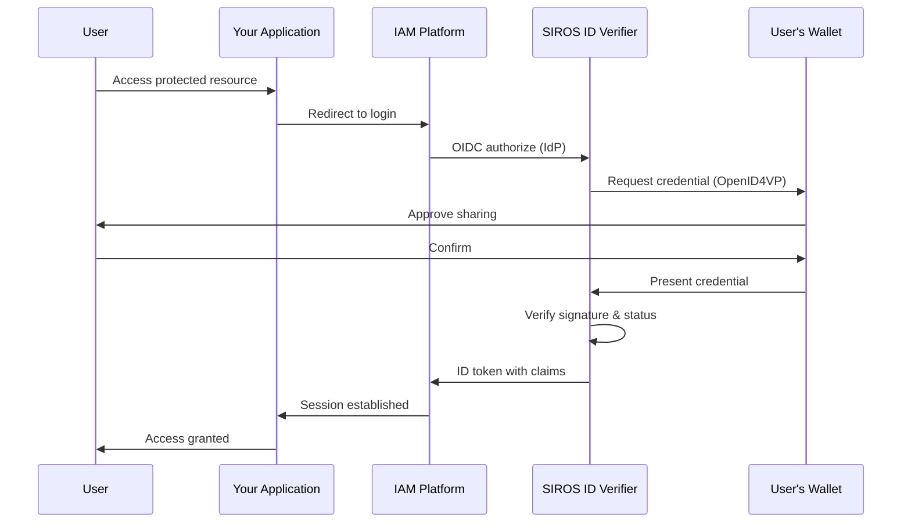

# Verifier Configuration

This guide provides detailed configuration options for the SIROS ID verifier. For conceptual background, see [Concepts & Architecture](./concepts). For deployment setup, see [Deployment](./deployment).

After reading this guide, you will understand how to:

- Connect your application to verify credentials
- Configure presentation requests
- Map verified claims to user sessions
- Deploy your own verifier (optional)

## Endpoints

The SIROS ID verifier exposes standard OIDC endpoints. For a self-hosted or on-premise deployment at `verifier.example.org`:

| Endpoint | URL |
|----------|-----|
| Discovery | `https://verifier.example.org/.well-known/openid-configuration` |
| Authorization | `https://verifier.example.org/authorize` |
| Token | `https://verifier.example.org/token` |
| JWKS | `https://verifier.example.org/jwks` |
| Registration | `https://verifier.example.org/register` |

:::info SIROS Hosted Service
When using the **SIROS ID hosted service**, verifiers use subdomain-based multi-tenancy:

```
https://<tenant>.verifier.id.siros.org
```

For example, tenant `acme-corp` with verifier instance `main`:
- `https://main.acme-corp.verifier.id.siros.org/.well-known/openid-configuration`
- `https://main.acme-corp.verifier.id.siros.org/authorize`

Each tenant has isolated configuration, and each verifier instance has its own client registrations and presentation policies.
:::

## Deployment Options

| Option | Best For | Requirements |
|--------|----------|-------------|
| **SIROS ID Hosted** | Quick integration, SaaS model | API credentials only |
| **Self-Hosted (Docker)** | On-premise, data sovereignty | Docker, MongoDB |
| **Self-Hosted (Binary)** | Custom infrastructure | Go 1.25+, MongoDB |

:::tip Recommendation
Start with the hosted service for development and testing. Move to self-hosted when you need data sovereignty or to integrate with internal trust frameworks.
:::

## Overview

The SIROS ID verifier implements two protocol interfaces:

1. **[OpenID Connect](https://openid.net/specs/openid-connect-core-1_0.html) Provider** – Standard OIDC interface for existing IAM systems
2. **[OpenID4VP](https://openid.net/specs/openid-4-verifiable-presentations-1_0.html)** – Direct verification for custom applications

This means you can add credential verification to your application without changing your existing authentication flow. The verifier accepts presentations from **any OID4VP-compatible wallet**—not just the SIROS ID Credential Manager.

:::info Wallet Interoperability
The verification flow works identically regardless of which wallet the user chooses:
- **SIROS ID Credential Manager** – Based on wwWallet with significant SIROS enhancements (shown in examples)
- **EUDI Reference Wallet** – EU Digital Identity reference implementation
- **Other OID4VP wallets** – Any wallet implementing the standard protocols

The diagram below uses "User's Wallet" to represent any compatible wallet.
:::



## Integration Options

### Option 1: OIDC Identity Provider (Recommended)

Add the SIROS ID verifier as an identity provider in your IAM system. This works with:

- **Keycloak** – See [Keycloak Integration](./keycloak_verifier)
- **Auth0** – Configure as Generic OIDC connection
- **Okta** – Add as Identity Provider
- **Microsoft Entra ID** – Add as External Identity Provider
- **Google Workspace** – Configure SAML app
- **Any OIDC-compatible IAM**

**Benefits:**
- No code changes to your application
- Leverage existing session management
- Works with federation and SSO

### Option 2: Direct OIDC Integration

Integrate directly as an OIDC Relying Party:

```javascript
// Example: Standard OIDC authorization request
const authUrl = new URL('https://verifier.example.org/authorize');
authUrl.searchParams.set('response_type', 'code');
authUrl.searchParams.set('client_id', 'your-client-id');
authUrl.searchParams.set('redirect_uri', 'https://your-app.com/callback');
authUrl.searchParams.set('scope', 'openid profile pid');
authUrl.searchParams.set('state', generateState());
authUrl.searchParams.set('code_challenge', generatePKCE());
authUrl.searchParams.set('code_challenge_method', 'S256');

window.location = authUrl.toString();
```

### Option 3: Direct OpenID4VP

There is no separate "start a presentation" REST API — a presentation session
is always created by an OIDC authorization request. Drive it the same way as
Option 2, then use the session endpoints to render your own UI:

```javascript
// 1. Send the user to /authorize with the scopes that select a
//    presentation-request template.
// 2. The verifier creates a session and renders the QR page itself, or you
//    can fetch the pieces for your own page:

// QR code image for a session
//   GET /qr/{session_id}
// Poll session state until the wallet has responded
//   GET /poll/{session_id}
// The signed request object the wallet fetches
//   GET /verification/request-object/{session_id}
```

For browser-native presentation without a QR code, use the
[W3C Digital Credentials API](./digital-credentials-api) instead.

## Client Registration

### Dynamic Registration (Recommended)

Use [RFC 7591](https://datatracker.ietf.org/doc/html/rfc7591) dynamic client registration:

```bash
curl -X POST https://verifier.example.org/register \
  -H "Content-Type: application/json" \
  -d '{
    "client_name": "My Application",
    "redirect_uris": ["https://my-app.com/callback"],
    "token_endpoint_auth_method": "client_secret_post",
    "grant_types": ["authorization_code", "refresh_token"],
    "response_types": ["code"],
    "scope": "openid profile pid ehic"
  }'
```

Response:
```json
{
  "client_id": "abc123",
  "client_secret": "secret456",
  "client_id_issued_at": 1704067200,
  "client_secret_expires_at": 0
}
```

### Static Registration

For production deployments, contact your verifier administrator or use the admin API to pre-register clients.

## Configuring Presentation Requests

### Scope-Based Requests

Map OIDC scopes to credential types:

| Scope | Credential | Claims |
|-------|------------|--------|
| `profile` | PID | `given_name`, `family_name`, `birth_date` |
| `pid` | PID | All PID claims |
| `ehic` | EHIC | Health insurance claims |
| `diploma` | Diploma | Educational credentials |

### DCQL Queries (Advanced)

For fine-grained control, use [Digital Credentials Query Language (DCQL)](https://openid.net/specs/openid-4-verifiable-presentations-1_0.html#name-digital-credentials-query-l):

Presentation requests live in `presentation_requests/*.yaml`, each holding a
`templates:` list. The DCQL query goes under a template's `dcql:` key:

```yaml
# presentation_requests/pid_and_ehic.yaml
templates:
  - id: "pid_and_ehic"
    name: "PID + EHIC"
    oidc_scopes: ["pid", "ehic"]
    dcql:
      credentials:
        - id: pid_credential
          format: dc+sd-jwt
          meta:
            vct_values:
              - urn:eudi:pid:arf-1.8:1
          claims:
            - path: ["given_name"]
            - path: ["family_name"]
            - path: ["birthdate"]

        - id: ehic_credential
          format: dc+sd-jwt
          meta:
            vct_values:
              - urn:eudi:ehic:1
          claims:
            - path: ["card_number"]
            - path: ["institution"]
    claim_mappings:
      "*": "*"
    enabled: true
```

## Verification Presets

Presets are the ready-made requests the verifier's own UI offers — each one a
labelled combination of credential scopes and claim selections, so an operator
demonstrating or testing the verifier does not have to hand-build a DCQL query.
The map key is the label shown to the user.

```yaml
verifier:
  presets:
    "PID":
      featured: true
      credentials:
        pid:
          exclude_claims:
            - path: ["trust_anchor"]
            - path: ["attestation_legal_category"]

    "PID Age Over 18":
      category: "Selective disclosure"
      order: 1
      credentials:
        pid:
          claims:
            - path: ["birthdate"]
          validations:
            - rule: "age_over"
              path: ["birthdate"]
              value: 18

    "PID + EHIC":
      category: "Combined"
      credentials:
        pid:
        ehic:
```

| Field | Purpose |
|---|---|
| `credentials` | Map of `common.credential_metadata` scope → optional overrides. At least one scope is required. An empty entry requests the scope's full VCTM claim set |
| `credentials.<scope>.claims` | Specific claims to request. When empty, all VCTM claims are used |
| `credentials.<scope>.exclude_claims` | Claims to drop from the generated DCQL query |
| `credentials.<scope>.validations` | Server-side rules applied after claims are extracted, e.g. `age_over` |
| `credentials.<scope>.format` | Overrides the scope's own format — e.g. requesting `mso_mdoc_zk` over a scope normally issued as `mso_mdoc` |
| `credentials.<scope>.zk_system_type` | Required whenever `format` is `mso_mdoc_zk`; identifies the system + circuit combination |
| `category` | Groups the preset under a shared UI heading |
| `order` | Position within the category, ascending; ties break alphabetically |
| `featured` | Featured presets are always shown; the rest are revealed progressively |

Presets drive the verifier's own pages. Presentation requests reached through
OIDC scopes come from `presentation_requests/*.yaml` instead — see
[DCQL Queries](#dcql-queries-advanced).

## Credential Revocation Checking

When enabled, the verifier checks each presented credential's Token Status List
entry at presentation time (ARF 3.0 §6.6.3.7):

```yaml
verifier:
  revocation:
    enabled: true
    # Seconds to cache fetched status list tokens
    cache_ttl: 300
    # true (the default) logs a warning and allows the credential through
    # when the status list is unreachable or unparseable; false rejects it
    fail_open: false
    # Scopes exempt from checking — e.g. credentials valid < 24h
    skip_scopes:
      - "short_lived_badge"
```

:::caution `fail_open` defaults to `true`
An unreachable status list is not evidence that a credential is valid, but the
default lets it through anyway. Turning revocation checking on without also
setting `fail_open: false` therefore buys less than it looks like: any
status-list outage silently disables the check. Set it to `false` unless
availability genuinely outranks the check for your deployment.
:::

## Combined Presentation Binding

When a wallet presents more than one credential in a single response, nothing
in the protocol guarantees they describe the *same* person. Combined
presentation verification (ARF 3.0 §6.6.3.10) checks that they do:

```yaml
verifier:
  combined_presentation:
    enabled: true
    # enforce | warn | disabled (default: warn)
    enforcement: "enforce"
    # Every listed path must match across all presented credentials
    binding_attributes:
      - paths: ["family_name", "birth_date", "place_of_birth.locality"]
    # Compare cnf.jwk / device key across credentials.
    # Cross-format comparison is limited — see below.
    key_binding_enabled: true
```

`enforcement: "enforce"` rejects a presentation whose credentials do not bind;
`warn` records the mismatch and proceeds. Attribute binding uses AND semantics
— every path in a `paths` list must match across all credentials.

## Zero-Knowledge Circuit Resolution

Verifying an `mso_mdoc_zk` (Longfellow ZK / PPID) presentation requires the
circuit the proof was produced against. The verifier resolves a presented
document's `zkSystemId` to a downloadable artifact through a catalog service:

```yaml
verifier:
  zk_circuits:
    # Mirrors of the same catalog, tried in order until one succeeds.
    # Defaults to the live deployed service.
    sources:
      - "https://zk-circuits.fly.dev"
```

The default is the live deployed service (`https://zk-circuits.fly.dev`). The
entries are mirrors of one catalog, not distinct registries — listing several
buys availability, not additional trust roots.

## OpenID4VP Compatibility

Every field here defaults to the conformant behaviour, so a deployment that
sets none of them is a plain OpenID4VP 1.0 deployment. Use it only to
interoperate with a wallet that still expects draft-era wire details:

```yaml
common:
  openid4vp_compat:
    # Re-add the draft-era authorization_encrypted_response_alg and
    # authorization_encrypted_response_enc members to client_metadata,
    # alongside the 1.0 encrypted_response_enc_values_supported
    send_legacy_jarm_encryption_params: true
```

## Claim Mapping

Verified credentials are mapped to standard OIDC claims in the ID token:

```json
{
  "iss": "https://verifier.example.org",
  "sub": "pairwise-user-id",
  "aud": "your-client-id",
  "exp": 1704153600,
  "iat": 1704067200,
  "given_name": "Alice",
  "family_name": "Smith",
  "birthdate": "1990-01-15",
  "nationality": "SE"
}
```

### Custom Claim Mapping

Claim mapping is per presentation-request template, in the
`presentation_requests/*.yaml` files — not a config-file key. Each template's
`claim_mappings` maps a credential claim name to the OIDC claim name it should
appear as:

```yaml
# presentation_requests/employee.yaml
templates:
  - id: "employee_badge"
    name: "Employee Badge"
    oidc_scopes: ["employee"]
    dcql:
      credentials:
        - id: badge
          format: dc+sd-jwt
          meta:
            vct_values: ["https://example.com/credentials/employee-badge"]
          claims:
            - path: ["given_name"]
            - path: ["family_name"]
            - path: ["employee_number"]
    claim_mappings:
      given_name: "given_name"
      family_name: "family_name"
      employee_number: "employee_id"   # rename on the way into the ID token
    enabled: true
```

Use `"*": "*"` to pass every disclosed claim through unchanged. Optional
`claim_transforms` can post-process individual values.

## W3C Digital Credentials API

For browser-based verification, the SIROS ID verifier supports the [W3C Digital Credentials API](https://wicg.github.io/digital-credentials/):

```javascript
// Browser-native credential request
const credential = await navigator.credentials.get({
  digital: {
    providers: [{
      protocol: "openid4vp",
      request: requestObject
    }]
  }
});
```

When enabled, users can present credentials with a single click—no QR code scanning needed.

### Browser Support

| Browser | Status |
|---------|--------|
| Chrome 116+ | ✅ Supported (with flag) |
| Edge 116+ | ✅ Supported (with flag) |
| Safari 17+ | ⚠️ Partial support |
| Firefox | 🔜 Planned |

The verifier automatically falls back to QR code when the DC API is unavailable.

## Security Features

### PKCE Enforcement

Public clients must use [PKCE (RFC 7636)](https://datatracker.ietf.org/doc/html/rfc7636):

```javascript
// Generate code verifier and challenge
const verifier = generateRandomString(64);
const challenge = base64url(sha256(verifier));
```

### Pairwise Subject Identifiers

By default, users receive different `sub` claims for each relying party, preventing cross-site tracking:

```yaml
verifier:
  outbound:
    oidc_provider:
      subject_type: "pairwise"  # or "public"
      subject_salt: "random-secret-value"
```

### Credential Verification

The verifier automatically:

1. ✅ Validates credential signature
2. ✅ Checks issuer trust (via trust framework)
3. ✅ Verifies credential status (revocation)
4. ✅ Validates credential expiration
5. ✅ Confirms credential type matches request

## API Endpoints

### OIDC Provider Endpoints

| Endpoint | Method | Description |
|----------|--------|-------------|
| `/.well-known/openid-configuration` | GET | OIDC discovery metadata |
| `/jwks` | GET | JSON Web Key Set |
| `/authorize` | GET | Start authorization |
| `/token` | POST | Exchange code for tokens |
| `/userinfo` | GET | Get user claims |
| `/register` | POST | Dynamic client registration |

### OpenID4VP Endpoints

| Endpoint | Method | Description |
|----------|--------|-------------|
| `/verification/request-object/{session_id}` | GET | Signed request object for an OIDC-initiated session |
| `/verification/oidc-direct_post` | POST | Receive the wallet's VP token (OIDC flow) |
| `/verification/oidc-callback` | GET | Wallet same-device return URL (OIDC flow) |
| `/verification/direct_post` | POST | Receive the wallet's VP token (browser-session flow) |
| `/verification/callback` | GET | Wallet same-device return URL (browser-session flow) |
| `/verification/display/{session_id}` | GET | Credential preview page (when `credential_display` is on) |
| `/verification/confirm/{session_id}` | POST | Confirm the previewed credential |
| `/qr/{session_id}` | GET | QR code image for a session |
| `/poll/{session_id}` | GET | Poll session state |

Presentation sessions are created by the OIDC `/authorize` request; there is no
endpoint that creates one directly.

## Testing

### Development Environment

For testing, you can use the SIROS ID demo environment or deploy a local verifier instance.

:::info SIROS Hosted Demo
The SIROS ID demo environment is available at:
- **Demo Verifier**: `https://main.demo.verifier.id.siros.org`
- **Demo Wallet**: `https://id.siros.org`
:::

### Test Credentials

Obtain test credentials from a demo issuer:

1. Open [id.siros.org](https://id.siros.org) on your phone
2. Navigate to "Add Credential"
3. Scan the demo issuer QR code
4. Accept the test credential

### Integration Testing

```bash
# Test OIDC discovery
curl https://verifier.example.org/.well-known/openid-configuration

# Verify JWKS
curl https://verifier.example.org/jwks
```

## Self-Hosted Deployment

If you need to run the verifier in your own infrastructure, you can deploy it using Docker or as a standalone binary.

### Docker Deployment (Recommended)

The verifier is available as a Docker image:

```bash
# Pull the verifier image (includes SAML and all credential format support)
docker pull ghcr.io/sirosfoundation/vc/verifier:latest
```

#### Docker Compose

Create a `docker-compose.yaml`:

```yaml
services:
  verifier:
    image: ghcr.io/sirosfoundation/vc/verifier:latest
    restart: always
    ports:
      - "8080:8080"
    volumes:
      - ./config.yaml:/config.yaml:ro
      - ./pki:/pki:ro
      - ./presentation_requests:/presentation_requests:ro
    environment:
      - VC_CONFIG_YAML=config.yaml
    depends_on:
      - mongo

  mongo:
    image: mongo:7
    restart: always
    volumes:
      - mongo-data:/data/db
    ports:
      - "27017:27017"

  # Optional: go-trust for trust evaluation
  go-trust:
    image: ghcr.io/sirosfoundation/go-trust:latest
    restart: always
    ports:
      - "6001:6001"
    volumes:
      - ./trust-config.yaml:/config.yaml:ro
    command: ["--config", "/config.yaml"]

volumes:
  mongo-data:
```

#### Verifier Configuration

Create `config.yaml`:

```yaml
verifier:
  api_server:
    addr: :8080
    tls:
      enable: false  # Use reverse proxy for TLS in production
  public_url: "https://verifier.example.com"

  # Signs JARs and OIDC tokens; published at /jwks
  key_config:
    private_key_path: "/pki/verifier_key.pem"
    chain_path: "/pki/verifier_chain.pem"

  # How the verifier identifies itself to wallets
  client_id_scheme: "x509_san_dns"   # or "x509_hash", "did"

  # Wallet-facing side: OpenID4VP
  inbound:
    openid4vp:
      presentation_timeout: 300
      presentation_requests_dir: "/presentation_requests"
      supported_credentials:
        - vct: "urn:eudi:pid:arf-1.8:1"
          scopes: ["openid", "profile"]
        - vct: "urn:eudi:ehic:1"
          scopes: ["ehic"]

  # RP-facing side: the verifier acting as an OIDC Provider
  outbound:
    oidc_provider:
      issuer: "https://verifier.example.com"
      session_duration: 900
      code_duration: 300
      access_token_duration: 3600
      id_token_duration: 3600
      subject_type: "pairwise"
      subject_salt: "put-this-in-the-secrets-file"

  # Trust evaluation via go-trust (AuthZEN)
  trust:
    pdp_url: "http://go-trust:6001"

  digital_credentials:
    enable: true
    use_jar: true
    allow_qr_fallback: true

common:
  mongo:
    uri: mongodb://mongo:27017
  production: true
  secret_file_path: "/etc/vc/secrets.yaml"
```

:::note
The vc config file is not environment-interpolated. Secrets such as
`subject_salt` go in the file referenced by `common.secret_file_path`, not in
`${VAR}` placeholders.
:::

#### Start the Services

```bash
# Generate the verifier signing key
openssl ecparam -name prime256v1 -genkey -noout -out pki/verifier_key.pem

# Start all services
docker compose up -d

# Check logs
docker compose logs -f verifier

# Verify health
curl http://localhost:8080/health
```

### Binary Deployment

For non-Docker environments:

```bash
# Clone the repository
git clone https://github.com/SUNET/vc.git
cd vc

# Build the verifier
make build-verifier

# Run
export VC_CONFIG_YAML=config.yaml
./bin/vc_verifier
```

### Kubernetes Deployment

For production Kubernetes deployments:

```yaml
apiVersion: apps/v1
kind: Deployment
metadata:
  name: verifier
spec:
  replicas: 2
  selector:
    matchLabels:
      app: verifier
  template:
    metadata:
      labels:
        app: verifier
    spec:
      containers:
        - name: verifier
          image: ghcr.io/sirosfoundation/vc/verifier:latest
          ports:
            - containerPort: 8080
          env:
            - name: VC_CONFIG_YAML
              value: /config/config.yaml
          volumeMounts:
            - name: config
              mountPath: /config
            - name: pki
              mountPath: /pki
            # subject_salt and other secrets come from the file named by
            # common.secret_file_path, not from environment variables.
            - name: secrets
              mountPath: /etc/vc
          livenessProbe:
            httpGet:
              path: /health
              port: 8080
            initialDelaySeconds: 10
          readinessProbe:
            httpGet:
              path: /health
              port: 8080
      volumes:
        - name: config
          configMap:
            name: verifier-config
        - name: pki
          secret:
            secretName: verifier-pki
        - name: secrets
          secret:
            secretName: verifier-secrets
```

## Next Steps

- [Keycloak Integration Guide](./keycloak_verifier)
- [Trust Services Configuration](../trust/)
- [Go-Trust AuthZEN Service](../trust/go-trust)
- [Issuing Credentials](../issuers/issuer)
