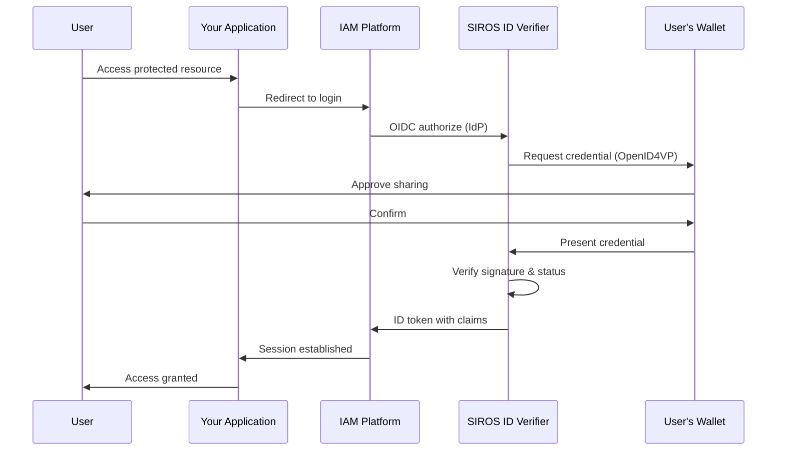

# Verifier Configuration

This guide provides detailed configuration options for the SIROS ID verifier. For conceptual background, see [Concepts & Architecture](./concepts). For deployment setup, see [Deployment](./deployment).

After reading this guide, you will understand how to:

- Connect your application to verify credentials
- Configure presentation requests
- Map verified claims to user sessions
- Deploy your own verifier (optional)

## Endpoints

The SIROS ID verifier exposes standard OIDC endpoints. For a self-hosted or on-premise deployment at `verifier.example.org`:

| Endpoint | URL |
|----------|-----|
| Discovery | `https://verifier.example.org/.well-known/openid-configuration` |
| Authorization | `https://verifier.example.org/authorize` |
| Token | `https://verifier.example.org/token` |
| JWKS | `https://verifier.example.org/jwks` |
| Registration | `https://verifier.example.org/register` |

:::info SIROS Hosted Service
When using the **SIROS ID hosted service**, verifiers use subdomain-based multi-tenancy:

```
https://<tenant>.verifier.id.siros.org
```

For example, tenant `acme-corp` with verifier instance `main`:
- `https://main.acme-corp.verifier.id.siros.org/.well-known/openid-configuration`
- `https://main.acme-corp.verifier.id.siros.org/authorize`

Each tenant has isolated configuration, and each verifier instance has its own client registrations and presentation policies.
:::

## Deployment Options

| Option | Best For | Requirements |
|--------|----------|-------------|
| **SIROS ID Hosted** | Quick integration, SaaS model | API credentials only |
| **Self-Hosted (Docker)** | On-premise, data sovereignty | Docker, MongoDB |
| **Self-Hosted (Binary)** | Custom infrastructure | Go (version per `go.mod`), MongoDB or a SQL database |

:::tip Recommendation
Start with the hosted service for development and testing. Move to self-hosted when you need data sovereignty or to integrate with internal trust frameworks.
:::

## Overview

The SIROS ID verifier implements two protocol interfaces:

1. **[OpenID Connect](https://openid.net/specs/openid-connect-core-1_0.html) Provider** – Standard OIDC interface for existing IAM systems
2. **[OpenID4VP](https://openid.net/specs/openid-4-verifiable-presentations-1_0.html)** – Direct verification for custom applications

This means you can add credential verification to your application without changing your existing authentication flow. The verifier accepts presentations from **any OID4VP-compatible wallet**—not just the SIROS ID Credential Manager.

:::info Wallet Interoperability
The verification flow works identically regardless of which wallet the user chooses:
- **SIROS ID Credential Manager** – Based on wwWallet with significant SIROS enhancements (shown in examples)
- **EUDI Reference Wallet** – EU Digital Identity reference implementation
- **Other OID4VP wallets** – Any wallet implementing the standard protocols

The diagram below uses "User's Wallet" to represent any compatible wallet.
:::



:::caution Not enforced on the OIDC `/authorize` path
The "verify" step above is intended behaviour. Currently, a presentation that answers an OIDC `/authorize` session (QR code or same-device link) is posted to `/verification/oidc-direct_post`, which does not verify the SD-JWT VC or mdoc signature and does not ask the PDP about the issuer. The checks run on `/verification/direct_post`, used by the verifier's own page at `/`.

Known issue: https://github.com/SUNET/vc/issues/761
:::

## Integration Options

### Option 1: OIDC Identity Provider (Recommended)

Add the SIROS ID verifier as an identity provider in your IAM system. This works with:

- **Keycloak** – See [Keycloak Integration](./keycloak_verifier)
- **Auth0** – Configure as Generic OIDC connection
- **Okta** – Add as Identity Provider
- **Microsoft Entra ID** – Add as External Identity Provider
- **Google Workspace** – Configure SAML app
- **Any OIDC-compatible IAM**

**Benefits:**
- No code changes to your application
- Leverage existing session management
- Works with federation and SSO

### Option 2: Direct OIDC Integration

Your application acts as an OIDC Relying Party and the verifier is its OpenID
Provider. Clients registered through `/register` must use PKCE (see
[PKCE Enforcement](#pkce-enforcement)):

```javascript
// Example: Standard OIDC authorization request
const authUrl = new URL('https://verifier.example.org/authorize');
authUrl.searchParams.set('response_type', 'code');
authUrl.searchParams.set('client_id', 'your-client-id');
authUrl.searchParams.set('redirect_uri', 'https://your-app.com/callback');
authUrl.searchParams.set('scope', 'openid profile pid');
authUrl.searchParams.set('state', generateState());
authUrl.searchParams.set('code_challenge', generatePKCE());
authUrl.searchParams.set('code_challenge_method', 'S256');

window.location = authUrl.toString();
```

### Option 3: Direct OpenID4VP

There is no separate "start a presentation" REST API, and no JSON API that
returns a session to a backend. A presentation session is always created by an
OIDC authorization request: `GET /authorize` renders the verifier's own HTML
page, which shows the QR code or same-device link, drives the wallet and polls
`/poll/{session_id}` itself. Your application starts the flow exactly as in
Option 2 and receives the verified claims through the normal OIDC code exchange.

To customise the page, use `verifier.authorization_page_css` (see
[UI Customization](./digital-credentials-api#ui-customization)). For
browser-native presentation without a QR code, use the
[W3C Digital Credentials API](./digital-credentials-api).

## Client Registration

### Dynamic Registration (Recommended)

Use [RFC 7591](https://datatracker.ietf.org/doc/html/rfc7591) dynamic client registration:

```bash
curl -X POST https://verifier.example.org/register \
  -H "Content-Type: application/json" \
  -d '{
    "client_name": "My Application",
    "redirect_uris": ["https://my-app.com/callback"],
    "token_endpoint_auth_method": "client_secret_post",
    "grant_types": ["authorization_code"],
    "response_types": ["code"],
    "scope": "openid pid ehic"
  }'
```

The `scope` string is the allow-list for this client: any scope not listed
here is later rejected with `invalid_scope`, and the default is `openid` only.
Register every scope you intend to request. The scopes must also exist on the
verifier (see [Scope-Based Requests](#scope-based-requests)).

Response:
```json
{
  "client_id": "abc123",
  "client_secret": "secret456",
  "client_id_issued_at": 1704067200,
  "client_secret_expires_at": 0,
  "registration_access_token": "...",
  "registration_client_uri": "https://verifier.example.org/register/abc123"
}
```

The `registration_access_token` authorizes the [RFC 7592](https://datatracker.ietf.org/doc/html/rfc7592)
management endpoints `GET`, `PUT` and `DELETE /register/{client_id}`. Who may
call `POST /register` is controlled by
`verifier.outbound.oidc_provider.dynamic_registration_auth` (`open` by default,
or `static` bearer token, or `jwt`).

:::note Refresh tokens
Refresh tokens are not implemented: the verifier only supports the
`authorization_code` grant. Registration accepts `refresh_token` in
`grant_types` but the token endpoint rejects it with
`unsupported_grant_type`.

Known issue: https://github.com/SUNET/vc/issues/759
:::

:::caution Client authentication at the token endpoint
Registration defaults `token_endpoint_auth_method` to `client_secret_basic`
and discovery advertises it, but the token endpoint currently reads
`client_id` and `client_secret` only from the form body. Register with
`client_secret_post` (as above) and configure your OIDC library to send the
credentials in the request body.

Known issue: https://github.com/SUNET/vc/issues/758
:::

### Static Registration

There is no admin API. For clients that must exist at startup, declare them in
the verifier's own configuration under
`verifier.outbound.oidc_provider.static_clients`:

```yaml
verifier:
  outbound:
    oidc_provider:
      static_clients:
        - client_id: "my-app"
          # Replaced by the value in the secrets file, see below
          client_secret: "set-in-secrets-file"
          redirect_uris: ["https://my-app.example.com/callback"]
          # Must list every credential scope the client will request
          allowed_scopes: ["openid", "pid", "ehic"]
          token_endpoint_auth_method: "client_secret_post"
          client_name: "My Application"
```

```yaml
# secrets.yaml (mode 0600)
verifier:
  outbound:
    oidc_provider:
      subject_salt: "random-secret-value"
      static_clients:
        "my-app": "the-client-secret"
```

If `allowed_scopes` is omitted it defaults to `openid`, `profile`, `email`,
`address` and `phone`, which does not include your credential scopes. PKCE is
not enforced for static clients (known issue: https://github.com/SUNET/vc/issues/757).

## Configuring Presentation Requests

### Scope-Based Requests

There is no built-in scope table. A scope you request at `/authorize` must pass
two checks:

1. It is in the client's allowed scopes (the `scope` string given at
   registration, or `allowed_scopes` for a static client).
2. It selects a credential on the verifier: it is either listed in a
   presentation-request template's `oidc_scopes`, or it is a key of
   `common.credential_metadata` (the scope then requests that credential
   type).

Scopes that match neither are ignored, and a request where no scope selects a
credential fails with "no valid credentials found for requested scopes". The
scopes the verifier advertises in discovery are `openid`, `profile`, `email`
plus every scope in `inbound.openid4vp.supported_credentials`.

The scopes available on your verifier are therefore whatever you configured. In
the example configuration on this page they are `pid` and `ehic`; the sample
templates shipped in the vc repository also define `profile` and `pid_full`.

### DCQL Queries (Advanced)

For fine-grained control, use [Digital Credentials Query Language (DCQL)](https://openid.net/specs/openid-4-verifiable-presentations-1_0.html#name-digital-credentials-query-l):

Presentation requests live in `presentation_requests/*.yaml`, each holding a
`templates:` list. The DCQL query goes under a template's `dcql:` key:

```yaml
# presentation_requests/pid_and_ehic.yaml
templates:
  - id: "pid_and_ehic"
    name: "PID + EHIC"
    oidc_scopes: ["pid", "ehic"]
    dcql:
      credentials:
        - id: pid_credential
          format: dc+sd-jwt
          meta:
            vct_values:
              - urn:eudi:pid:1
          claims:
            - path: ["given_name"]
            - path: ["family_name"]
            - path: ["birthdate"]

        - id: ehic_credential
          format: dc+sd-jwt
          meta:
            vct_values:
              - urn:eudi:ehic:1
          claims:
            - path: ["card_number"]
            - path: ["institution"]
    claim_mappings:
      "*": "*"
```

Every template in the directory is active; to disable one, remove it from the
directory. (A template's `enabled` field cannot be used for this: `enabled:
false` is overridden to `true` when the file is loaded. Known issue: https://github.com/SUNET/vc/issues/754.) The `vct_values` must
match the `vct` the issuer puts in the credentials your users hold.

DCQL is the only query language the verifier supports; Presentation Exchange
is not.

## Trust Evaluation

Issuer trust is decided by an [AuthZEN](https://openid.github.io/authzen/)
Policy Decision Point such as [go-trust](../trust/go-trust):

```yaml
verifier:
  trust:
    # AuthZEN PDP used for every trust decision
    pdp_url: "http://go-trust:6001"
    # Restrict accepted JWT signature algorithms (default: ES*, RS*, PS*, EdDSA)
    allowed_signature_algorithms: ["ES256", "ES384"]
```

:::danger A PDP is required for production
A PDP is required for production use. With `pdp_url` set, every trust decision
goes through the PDP in "default deny" mode. If `pdp_url` is omitted, the
verifier runs in "allow all" mode: issuer trust is not evaluated (every issuer
is trusted, with only a log warning at startup) and only self-contained
`did:key` and `did:jwk` identifiers are resolved, locally; other DID methods
cannot be resolved. That mode may work for some things but is not supported:
use it for development and testing only, with no guarantees.
:::

## Verification Presets

Presets are the ready-made requests the verifier's own UI offers — each one a
labelled combination of credential scopes and claim selections, so an operator
demonstrating or testing the verifier does not have to hand-build a DCQL query.
The map key is the label shown to the user.

```yaml
verifier:
  presets:
    "PID":
      featured: true
      credentials:
        pid:
          exclude_claims:
            - path: ["trust_anchor"]
            - path: ["attestation_legal_category"]

    "PID Age Over 18":
      category: "Selective disclosure"
      order: 1
      credentials:
        pid:
          claims:
            - path: ["birthdate"]
          validations:
            - rule: "age_over"
              path: ["birthdate"]
              value: 18

    "PID + EHIC":
      category: "Combined"
      credentials:
        pid:
        ehic:
```

| Field | Purpose |
|---|---|
| `credentials` | Map of `common.credential_metadata` scope → optional overrides. At least one scope is required. An empty entry requests the scope's full VCTM claim set |
| `credentials.<scope>.claims` | Specific claims to request. When empty, all VCTM claims are used |
| `credentials.<scope>.exclude_claims` | Claims to drop from the generated DCQL query |
| `credentials.<scope>.validations` | Server-side rules applied after claims are extracted, e.g. `age_over` |
| `credentials.<scope>.format` | Overrides the scope's own format — e.g. requesting `mso_mdoc_zk` over a scope normally issued as `mso_mdoc` |
| `credentials.<scope>.zk_system_type` | Required whenever `format` is `mso_mdoc_zk`; identifies the system + circuit combination |
| `category` | Groups the preset under a shared UI heading |
| `order` | Position within the category, ascending; ties break alphabetically |
| `featured` | Featured presets are always shown; the rest are revealed progressively |

Presets drive the verifier's own pages. Presentation requests reached through
OIDC scopes come from `presentation_requests/*.yaml` instead — see
[DCQL Queries](#dcql-queries-advanced).

## Credential Revocation Checking

When enabled, the verifier checks each presented credential's Token Status List
entry at presentation time (ARF 3.0 §6.6.3.7):

```yaml
verifier:
  revocation:
    enabled: true
    # Seconds to cache fetched status list tokens
    cache_ttl: 300
    # true (the default) logs a warning and allows the credential through
    # when the status list is unreachable or unparseable
    fail_open: true
    # Scopes exempt from checking — e.g. credentials valid < 24h
    skip_scopes:
      - "short_lived_badge"
```

:::caution `fail_open` cannot currently be set to `false`
`fail_open` defaults to `true`, so any status-list outage silently lets
credentials through. The intended fail-closed setting, `fail_open: false`, has
no effect at present: the configuration loader treats an explicit `false` as
unset and re-applies the default `true`. Until this is fixed the verifier
always fails open on an unreachable or unparseable status list. Explicitly
revoked or suspended credentials are always rejected.

Known issue: https://github.com/SUNET/vc/issues/753
:::

## Other Settings

| Key | Purpose |
|-----|---------|
| `verifier.inbound.openid4vp.response_mode` | `direct_post` or `direct_post.jwt`: the response mode for request objects delivered by QR code or same-device link. When unset it is derived from `digital_credentials.response_mode`, with any `dc_api` mode mapped to the equivalent `direct_post` mode |
| `verifier.api_server.cors.allowed_origins` | Origins allowed to call `/token`, `/jwks`, `/register` from a browser (needed by single-page applications) |
| `verifier.api_server.trust_proxy_tls` | Set `true` behind a TLS-terminating proxy so session cookies keep the `Secure` flag |
| `verifier.outbound.oidc_provider.enable_userinfo` | Advertise `/userinfo` and issue JWT access tokens (default `true`) |
| `verifier.client_id_scheme` | `x509_san_dns` (default), `x509_hash` or `did`; `did` also needs `verifier.did` |
| `common.sql.backend` | Use a SQL database as the primary store instead of MongoDB |

:::caution `enable_userinfo: false` has no effect
Like `fail_open` above, an explicit `false` is overwritten by the `true` default,
so `/userinfo` cannot currently be switched off.

Known issue: https://github.com/SUNET/vc/issues/753
:::

The full key list is in the
[VC Configuration Reference](/sirosid/reference/vc-configuration).

## Combined Presentation Binding

When a wallet presents more than one credential in a single response, nothing
in the protocol guarantees they describe the *same* person. Combined
presentation verification (ARF 3.0 §6.6.3.10) checks that they do:

```yaml
verifier:
  combined_presentation:
    enabled: true
    # enforce | warn | disabled (default: warn)
    enforcement: "enforce"
    # Every listed path must match across all presented credentials
    binding_attributes:
      - paths: ["family_name", "birthdate", "place_of_birth.locality"]
    # Compare cnf.jwk / device key across credentials. Works across formats
    # (SD-JWT cnf.jwk vs mdoc device key) by comparing RFC 7638 thumbprints.
    key_binding_enabled: true
```

`enforcement: "enforce"` rejects a presentation whose credentials do not bind;
`warn` records the mismatch and proceeds. Attribute binding uses AND semantics
— every path in a `paths` list must match across all credentials.

## Zero-Knowledge Circuit Resolution

Verifying an `mso_mdoc_zk` (Longfellow ZK / PPID) presentation requires the
circuit the proof was produced against. The verifier resolves a presented
document's `zkSystemId` to a downloadable artifact through a catalog service:

```yaml
verifier:
  zk_circuits:
    # Mirrors of the same catalog, tried in order until one succeeds.
    # Defaults to the live deployed service.
    sources:
      - "https://zk-circuits.fly.dev"
```

This setting is only consulted by builds with the `zknative` Go build tag
(`make build-verifier-zknative`, or the `verifier-zknative` Docker image); the
default build ignores it and does not verify `mso_mdoc_zk` presentations
natively.

The default is the live deployed service (`https://zk-circuits.fly.dev`). The
entries are mirrors of one catalog, not distinct registries — listing several
buys availability, not additional trust roots.

## OpenID4VP Compatibility

Every field here defaults to the conformant behaviour, so a deployment that
sets none of them is a plain OpenID4VP 1.0 deployment. Use it only to
interoperate with a wallet that still expects draft-era wire details:

```yaml
common:
  openid4vp_compat:
    # Re-add the draft-era authorization_encrypted_response_alg and
    # authorization_encrypted_response_enc members to client_metadata,
    # alongside the 1.0 encrypted_response_enc_values_supported
    send_legacy_jarm_encryption_params: true
```

## Claim Mapping

Verified credentials are mapped to standard OIDC claims in the ID token:

```json
{
  "iss": "https://verifier.example.org",
  "sub": "pairwise-user-id",
  "aud": "your-client-id",
  "exp": 1704153600,
  "iat": 1704067200,
  "given_name": "Alice",
  "family_name": "Smith",
  "birthdate": "1990-01-15",
  "nationalities": ["SE"]
}
```

### Custom Claim Mapping

Claim mapping is per presentation-request template, in the
`presentation_requests/*.yaml` files — not a config-file key. Each template's
`claim_mappings` maps a credential claim name to the OIDC claim name it should
appear as:

```yaml
# presentation_requests/employee.yaml
templates:
  - id: "employee_badge"
    name: "Employee Badge"
    oidc_scopes: ["employee"]
    dcql:
      credentials:
        - id: badge
          format: dc+sd-jwt
          meta:
            vct_values: ["https://example.com/credentials/employee-badge"]
          claims:
            - path: ["given_name"]
            - path: ["family_name"]
            - path: ["employee_number"]
    claim_mappings:
      given_name: "given_name"
      family_name: "family_name"
      employee_number: "employee_id"   # rename on the way into the ID token
```

Use `"*": "*"` to pass every disclosed claim through unchanged. There is no
claim transformation step: a template that contains a `claim_transforms` key
is rejected when it is loaded.

## W3C Digital Credentials API

For browser-based verification the verifier supports the [W3C Digital Credentials API](https://w3c-fedid.github.io/digital-credentials/). When
`verifier.digital_credentials.enable` is `true`, the authorization page asks
the browser for the credential with a single click, without a QR code. The page
uses the [`@sirosfoundation/dc-api`](https://github.com/sirosfoundation/dc-api)
library and the signed OpenID4VP protocol (`openid4vp-v1-signed`), so the
browser must allow that protocol. If it does not, or the API is unavailable,
the page falls back to the QR code / same-device link.

See [W3C Digital Credentials API](./digital-credentials-api) for the
configuration options, browser requirements and troubleshooting.

## Security Features

### PKCE Enforcement

[PKCE (RFC 7636)](https://datatracker.ietf.org/doc/html/rfc7636) with `S256` is
required for every client registered through `/register`, public or
confidential: `/authorize` without a `code_challenge` fails with
`invalid_request`. It is not enforced for static clients (known issue: https://github.com/SUNET/vc/issues/757).

```javascript
// Generate code verifier and challenge
const verifier = generateRandomString(64);
const challenge = base64url(sha256(verifier));
```

### Subject Identifiers

The ID token `sub` is controlled by two settings, both required, and applies to
every client of the verifier (a `subject_type` given at client registration is
ignored). With `pairwise`, `sub` is derived from the wallet, the client and the
salt, so each relying party sees a different value and cannot correlate users
across sites:

```yaml
verifier:
  outbound:
    oidc_provider:
      subject_type: "pairwise"  # or "public"
      subject_salt: "random-secret-value"  # put it in the secrets file
```

### Credential Verification

For each presentation that reaches `/verification/direct_post` (the verifier's own page) the verifier:

1. Validates the credential signature
2. Checks issuer trust through the configured PDP (see below)
3. Checks credential status (revocation), when `verifier.revocation.enabled` is set
4. Validates credential expiration
5. Confirms the credential type matches the request

:::danger A PDP is required for production
Issuer trust is only evaluated when `verifier.trust.pdp_url` points at an
AuthZEN Policy Decision Point such as [go-trust](../trust/go-trust). Without it
the verifier starts in "allow all" mode: it logs a warning, every issuer is
trusted, and only `did:key` and `did:jwk` are resolved (locally). It may work
for some things but is not supported. Run without `pdp_url` only for
development and testing, never in production.
:::

Presentations answering an OIDC `/authorize` session (`/verification/oidc-direct_post`) currently skip steps 1 and 2 for SD-JWT VC and mdoc (known issue: https://github.com/SUNET/vc/issues/761).

## API Endpoints

### OIDC Provider Endpoints

| Endpoint | Method | Description |
|----------|--------|-------------|
| `/.well-known/openid-configuration` | GET | OIDC discovery metadata |
| `/jwks` | GET | JSON Web Key Set |
| `/authorize` | GET | Start authorization |
| `/token` | POST | Exchange code for tokens |
| `/userinfo` | GET | Get user claims |
| `/register` | POST | Dynamic client registration (RFC 7591) |
| `/register/{client_id}` | GET, PUT, DELETE | Client configuration management (RFC 7592, needs the `registration_access_token`) |

### OpenID4VP Endpoints

| Endpoint | Method | Description |
|----------|--------|-------------|
| `/verification/request-object/{session_id}` | GET | Signed request object for an OIDC-initiated session |
| `/verification/oidc-direct_post` | POST | Receive the wallet's VP token (OIDC flow) |
| `/verification/oidc-callback` | GET | Wallet same-device return URL (OIDC flow) |
| `/verification/direct_post` | POST | Receive the wallet's VP token (browser-session flow) |
| `/verification/callback` | GET | Wallet same-device return URL (browser-session flow) |
| `/verification/display/{session_id}` | GET | Credential preview page (when `credential_display` is on) |
| `/verification/confirm/{session_id}` | POST | Confirm the previewed credential |
| `/qr/{session_id}` | GET | QR code image for a session |
| `/poll/{session_id}` | GET | Poll session state |

Presentation sessions are created by the OIDC `/authorize` request; there is no
endpoint that creates one directly.

## Testing

### Development Environment

For testing, you can use the SIROS ID demo environment or deploy a local verifier instance.

:::info SIROS Hosted Demo
The SIROS ID demo environment is available at:
- **Demo Verifier**: `https://main.demo.verifier.id.siros.org`
- **Demo Wallet**: `https://id.siros.org`
:::

### Test Credentials

Obtain test credentials from a demo issuer:

1. Open [id.siros.org](https://id.siros.org) on your phone
2. Navigate to "Add Credential"
3. Scan the demo issuer QR code
4. Accept the test credential

### Integration Testing

```bash
# Test OIDC discovery
curl https://verifier.example.org/.well-known/openid-configuration

# Verify JWKS
curl https://verifier.example.org/jwks
```

## Self-Hosted Deployment

If you need to run the verifier in your own infrastructure, you can deploy it using Docker or as a standalone binary.

### Docker Deployment (Recommended)

The verifier is available as a Docker image:

```bash
# Pull the verifier image (includes SAML and all credential format support)
docker pull ghcr.io/sirosfoundation/vc/verifier:latest
```

#### Docker Compose

Create a `docker-compose.yaml`:

```yaml
services:
  verifier:
    image: ghcr.io/sirosfoundation/vc/verifier:latest
    restart: always
    ports:
      - "8080:8080"
    volumes:
      - ./config.yaml:/config.yaml:ro
      - ./secrets.yaml:/etc/vc/secrets.yaml:ro   # chmod 0600
      - ./pki:/pki:ro
      - ./metadata:/metadata:ro
      - ./presentation_requests:/presentation_requests:ro
    environment:
      - VC_CONFIG_YAML=/config.yaml
    depends_on:
      - mongo
      - go-trust

  mongo:
    image: mongo:7
    restart: always
    volumes:
      - mongo-data:/data/db

  # go-trust: the AuthZEN PDP. Required for production use, see below.
  go-trust:
    image: ghcr.io/sirosfoundation/go-trust:latest
    restart: always
    ports:
      - "6001:6001"
    volumes:
      - ./trust-config.yaml:/config.yaml:ro
    command: ["--config", "/config.yaml"]

volumes:
  mongo-data:
```

The `metadata/` directory holds the Verifiable Credential Type Metadata (VCTM)
files that `common.credential_metadata` points at. Copy the ones you need from
the `metadata/` directory of the [vc repository](https://github.com/SUNET/vc)
(for example `vctm_pid.json` and `vctm_ehic.json`).

:::danger A PDP is required for production
The `go-trust` service above provides the Policy Decision Point that
`verifier.trust.pdp_url` refers to. A PDP is required for production use.
Without `pdp_url` the verifier trusts every issuer and resolves only `did:key`/`did:jwk`
locally; that mode may work for some things but is not supported, so use it for
development and testing only.
:::

:::note Mounted keys and secrets must be readable by the container user
The verifier image runs as an unprivileged user (uid 100 or 65532, depending on the image build), so a `0600` key or secrets file owned by you on the host is unreadable inside the container: the key fails to load (`PKI signing key not loaded ... permission denied`) or startup panics with `failed to load secrets file`. Either `chown` the files to the container's uid (keeping mode `0600` or `0400`) or run the service as your own user with `user: "<uid>:<gid>"` in the Compose file.
:::

#### Verifier Configuration

Create `config.yaml`. This configuration passes the verifier's startup
validation:

```yaml
common:
  mongo:
    uri: mongodb://mongo:27017
  production: true
  secret_file_path: "/etc/vc/secrets.yaml"

  # Required: the credential types this verifier can request. Each key is a
  # scope name usable at /authorize.
  credential_metadata:
    pid:
      vctm_file_path: "/metadata/vctm_pid.json"
      format: "dc+sd-jwt"
    ehic:
      vctm_file_path: "/metadata/vctm_ehic.json"
      format: "dc+sd-jwt"

verifier:
  api_server:
    addr: :8080
    # TLS is terminated by a reverse proxy; keep session cookies Secure
    trust_proxy_tls: true
  public_url: "https://verifier.example.org"

  # Signs request objects (JARs) and OIDC tokens; published at /jwks
  key_config:
    private_key_path: "/pki/verifier_key.pem"
    chain_path: "/pki/verifier_chain.pem"

  # How the verifier identifies itself to wallets. x509_san_dns needs a
  # certificate whose DNS SAN matches the host of public_url.
  client_id_scheme: "x509_san_dns"   # or "x509_hash", "did"

  # Wallet-facing side: OpenID4VP
  inbound:
    openid4vp:
      token_endpoint: "https://verifier.example.org/token"
      presentation_requests_dir: "/presentation_requests"
      # Every scope here must appear in some clients[].scopes entry below, and
      # vice versa, or startup validation fails.
      supported_credentials:
        - vct: "urn:eudi:pid:1"
          scopes: ["pid"]
        - vct: "urn:eudi:ehic:1"
          scopes: ["ehic"]
      clients:
        "default":
          type: "public"
          redirect_uri: "https://verifier.example.org/"
          scopes: ["pid", "ehic"]

  # RP-facing side: the verifier acting as an OpenID Provider
  outbound:
    oidc_provider:
      issuer: "https://verifier.example.org"
      code_duration: 300
      access_token_duration: 3600
      id_token_duration: 3600
      subject_type: "pairwise"
      # Overwritten by the value in the secrets file
      subject_salt: "set-in-secrets-file"

  # Trust evaluation via go-trust (AuthZEN). Required for production.
  trust:
    pdp_url: "http://go-trust:6001"

  digital_credentials:
    enable: true
    use_jar: true
    allow_qr_fallback: true
```

`inbound.openid4vp.clients` and `token_endpoint` are required by validation.
The only cross-check is that the scopes in `clients` and in
`supported_credentials` match each other, so a single entry listing all your
credential scopes is enough. Relying parties are registered separately, see
[Client Registration](#client-registration).

Create `secrets.yaml` with mode `0600` or `0400` (the verifier refuses a
secrets file that is readable by group or others unless
`common.skip_secrets_perm_check` is `true`):

```yaml
verifier:
  outbound:
    oidc_provider:
      subject_salt: "a-long-random-secret"
```

:::note
The vc config file is not environment-interpolated. Secrets such as
`subject_salt` go in the file referenced by `common.secret_file_path`, not in
`${VAR}` placeholders. The reference configuration for every key is the
[VC Configuration Reference](/sirosid/reference/vc-configuration).
:::

#### Start the Services

```bash
# Generate the verifier signing key
mkdir -p pki
openssl ecparam -name prime256v1 -genkey -noout -out pki/verifier_key.pem

# Development only: a self-signed certificate whose DNS SAN matches public_url.
# In production use a certificate chain issued by a CA your wallets trust.
openssl req -x509 -new -key pki/verifier_key.pem -sha256 -days 365 \
  -subj "/CN=verifier.example.org" \
  -addext "subjectAltName=DNS:verifier.example.org" \
  -out pki/verifier_chain.pem

chmod 600 secrets.yaml

# Start all services
docker compose up -d

# Check logs
docker compose logs -f verifier

# Verify health
curl http://localhost:8080/health
```

### Binary Deployment

For non-Docker environments:

```bash
# Clone the repository
git clone https://github.com/SUNET/vc.git
cd vc

# Build the verifier (does not verify mso_mdoc_zk natively; for that use
# make build-verifier-zknative)
make build-verifier

# Run
export VC_CONFIG_YAML=config.yaml
./bin/vc_verifier
```

### Kubernetes Deployment

For production Kubernetes deployments:

```yaml
apiVersion: apps/v1
kind: Deployment
metadata:
  name: verifier
spec:
  replicas: 2
  selector:
    matchLabels:
      app: verifier
  template:
    metadata:
      labels:
        app: verifier
    spec:
      containers:
        - name: verifier
          image: ghcr.io/sirosfoundation/vc/verifier:latest
          ports:
            - containerPort: 8080
          env:
            - name: VC_CONFIG_YAML
              value: /config/config.yaml
          volumeMounts:
            - name: config
              mountPath: /config
            - name: pki
              mountPath: /pki
            # subject_salt and other secrets come from the file named by
            # common.secret_file_path (/etc/vc/secrets.yaml), not from
            # environment variables.
            - name: secrets
              mountPath: /etc/vc
            # VCTM files referenced by common.credential_metadata
            - name: metadata
              mountPath: /metadata
          livenessProbe:
            httpGet:
              path: /health
              port: 8080
            initialDelaySeconds: 10
          readinessProbe:
            httpGet:
              path: /health
              port: 8080
      volumes:
        - name: config
          configMap:
            name: verifier-config
        - name: pki
          secret:
            secretName: verifier-pki
        - name: secrets
          secret:
            secretName: verifier-secrets
            # Kubernetes' default 0644 is rejected by the secrets loader
            defaultMode: 0400
        - name: metadata
          configMap:
            name: verifier-metadata
```

The ConfigMap and Secret are not shown. The mounted paths must match the paths
referenced in `config.yaml` (`/pki`, `/metadata`, `common.secret_file_path`,
and `presentation_requests_dir` if you set it).

## Next Steps

- [Verifier Docker Quick Start](/howto/verifier-docker-quickstart)
- [Keycloak Integration Guide](./keycloak_verifier)
- [Trust Services Configuration](../trust/)
- [Go-Trust AuthZEN Service](../trust/go-trust)
- [Issuing Credentials](../issuers/issuer)
