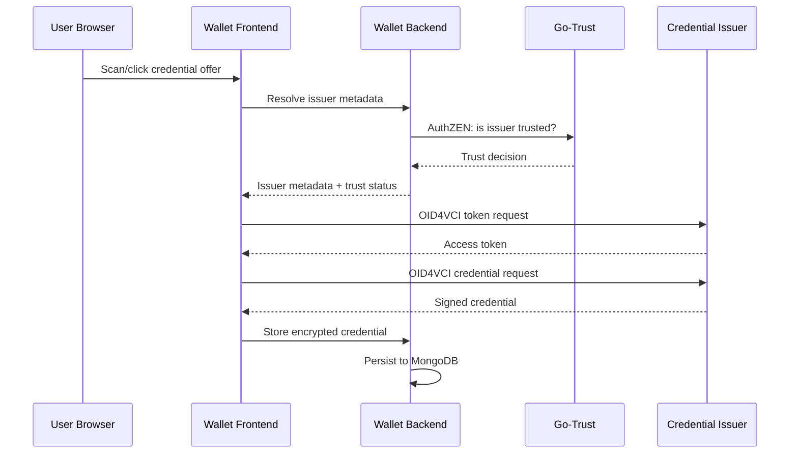
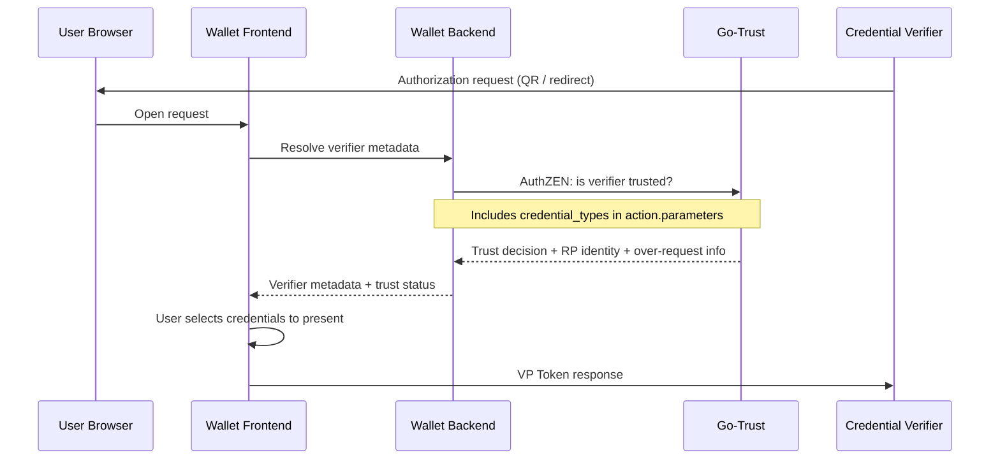

# Architecture

The credential manager is a three-tier architecture: a static frontend served by Nginx, a Go backend exposing REST and WebSocket APIs, and a trust evaluation sidecar.

## Component Roles

### Wallet Frontend

A **React PWA** built with Vite and served by Nginx. The frontend is a static single-page application — all credential protocol logic (OID4VCI issuance, OID4VP presentation) runs in the browser. The backend is used for authentication, credential storage, and protocol proxying.

**Runtime configuration** is injected at container startup (not baked into the build). A Node.js script reads environment variables and writes `<meta>` tags and generated files (manifest, theme CSS, well-known endpoints) into the served HTML. This means you configure the frontend entirely through environment variables or Docker build secrets.

Key characteristics:
- Nginx serves static files on port **80** with SPA fallback
- PWA with offline support via Workbox service worker
- WebAuthn-based authentication (no passwords)
- All credentials encrypted client-side with keys derived from the user's passkey

### Wallet Backend

A **Go service** (Gin framework) that can run as a single process or as separate role-based processes. It provides:

| Role | Default Port | Protocol | Purpose |
|------|-------------|----------|---------|
| `backend` | 8080 | HTTP REST | User auth, credential CRUD, issuer/verifier metadata, proxy |
| `engine` | 8082 | WebSocket | Real-time OID4VCI/OID4VP session management |
| `admin` | 8081 | HTTP REST | Tenant and user administration (token-protected) |
| `registry` | 8097 | HTTP REST | VCTM (Verifiable Credential Type Metadata) registry |

In a small deployment, run all roles in a single process with `--mode=all`. For production with horizontal scaling, run each role as a separate container and connect them via `external_urls`.

### Go-Trust

A **stateless AuthZEN PDP** that evaluates trust decisions against multiple registries. The wallet backend delegates trust checks (e.g., "is this issuer trusted?") to go-trust via the AuthZEN evaluation API. See [Go-Trust documentation](/sirosid/trust/go-trust) for full details.

Go-trust has no database — it loads trust data from certificate bundles, trust lists, and federation endpoints at startup and refreshes periodically.

## Data Flow

### Credential Issuance (OID4VCI)



### Credential Presentation (OID4VP)



### Trust Decision Flow with Credential Filtering

When the wallet backend resolves verifier metadata, it extracts **credential types** from the issuer/verifier's OID4VCI metadata and forwards them to Go-Trust as part of the AuthZEN evaluation request. This enables trust policies that differ by credential format.

The flow:

1. The wallet backend receives a resolve request (e.g., `/v1/resolve` with `resource_type=credential_issuer` or `credential_offer_uri`)
2. It fetches the entity's OID4VCI metadata and calls `collectCredentialTypes()` to extract supported credential type identifiers (VCT values, `mso_mdoc` doctypes, etc.)
3. The extracted `credential_types` are included in `action.parameters` of the AuthZEN evaluation request to Go-Trust
4. Go-Trust can use these parameters in policy decisions — for example, requiring qualified trust for PID credentials but allowing federation trust for educational credentials
5. The response includes the trust decision along with any enrichment data (matched policy OIDs, RP profile, over-request detection)

## Network Topology

All three services should be deployed behind a reverse proxy that terminates TLS. A typical setup:

```
                        ┌─────────────────────────────────┐
                        │  Reverse Proxy (TLS termination) │
Internet ──── HTTPS ────│  e.g., Caddy, Traefik, Nginx     │
                        └──────────┬──────────┬───────────┘
                                   │          │
                        ┌──────────▼──┐  ┌────▼───────────┐
                        │   Frontend  │  │  Backend        │
                        │   :80       │  │  :8080 (REST)   │
                        │             │  │  :8082 (WS)     │
                        └─────────────┘  │  :8081 (Admin)  │
                                         └────┬────────────┘
                                              │
                                    ┌─────────▼─────────┐
                                    │   Go-Trust :6001   │
                                    └───────────────────┘
```

The **admin API** (port 8081) should **not** be exposed to the internet. It is protected by a bearer token and should be accessible only from your management network.

## DNS and Origins

The credential manager uses WebAuthn, which binds credentials to a specific **origin** (scheme + hostname). When deploying on your own domain:

- The `WEBAUTHN_RPID` (frontend) and `server.rp_id` (backend) must match your domain
- The `WALLET_SERVER_RP_ORIGIN` must match the exact origin users see (e.g., `https://wallet.example.com`)
- Changing the domain after users have registered will **invalidate all existing passkeys**

:::caution Origin Binding
Plan your domain carefully before going to production. WebAuthn credentials cannot be migrated between origins.
:::
