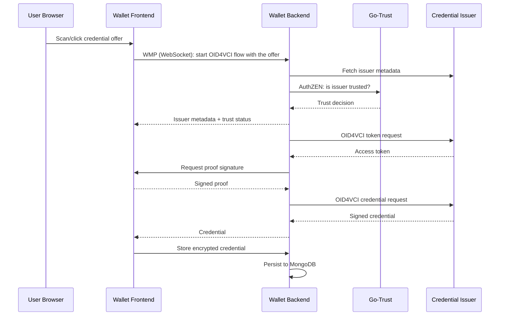
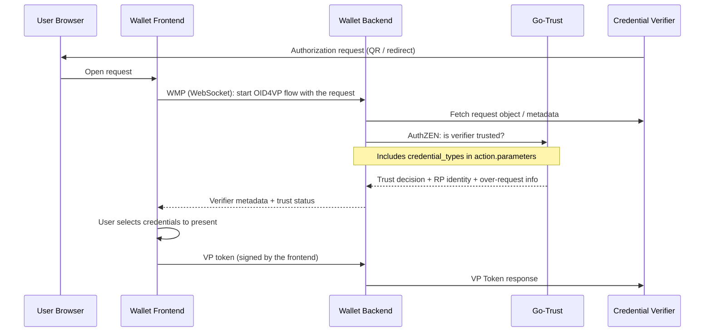

# Architecture

The credential manager is a three-tier architecture: a static frontend served by Nginx, a Go backend exposing REST and WebSocket APIs, and a trust evaluation sidecar.

## Component Roles

### Wallet Frontend

A **React PWA** built with Vite and served by Nginx. The frontend is a static single-page application. By default (transport `websocket`) it drives OID4VCI issuance and OID4VP presentation over the Wallet Messaging Protocol (WMP) WebSocket, and the protocol requests to issuers and verifiers are made by the backend `engine` role; the frontend holds the keys and performs the signing. With the optional `direct` transport the frontend talks to issuers and verifiers itself. The backend is also used for authentication and encrypted storage.

**Runtime configuration** is injected at container startup (not baked into the build). A Node.js script reads environment variables and writes `<meta>` tags and generated files (manifest, theme CSS, well-known endpoints) into the served HTML. This means you configure the frontend entirely through environment variables or Docker build secrets.

Key characteristics:
- Nginx serves static files on port **80** with SPA fallback
- PWA with offline support via Workbox service worker
- WebAuthn-based authentication (no passwords)
- All credentials encrypted client-side with keys derived from the user's passkey

### Wallet Backend

A **Go service** (Gin framework) that can run as a single process or as separate role-based processes. It provides:

| Role | Default Port | Protocol | Purpose |
|------|-------------|----------|---------|
| `backend` | 8080 | HTTP REST | User auth, credential CRUD, issuer/verifier metadata, proxy |
| `engine` | 8082 | WebSocket | Real-time OID4VCI/OID4VP session management |
| `admin` | 8081 | HTTP REST | Tenant and user administration (token-protected) |
| `registry` | 8097 | HTTP REST | VCTM (Verifiable Credential Type Metadata) registry |
| `auth` | — | HTTP REST | Built-in OAuth authorization server (`as.*` configuration) |
| `wallet-provider` | — | HTTP REST | Wallet provider endpoints (WIA, key attestation), optionally on a separate server for key-operation isolation |

The `--mode` flag selects the roles of a process (comma-separated, or `all`); the default is `backend`. In a small deployment, run all roles in a single process with `--mode=all`. For production with horizontal scaling, run each role as a separate container and connect them via `server.external_urls`.

### Go-Trust

A **stateless AuthZEN PDP** that evaluates trust decisions against multiple registries. The wallet backend delegates trust checks (e.g., "is this issuer trusted?") to go-trust via the AuthZEN evaluation API. A PDP is required for production use; running without one is not supported: some flows may work with allow-all trust, but PDP-based key resolution (including `did:` methods) is unavailable, so it is for testing and development only. See [Go-Trust documentation](/sirosid/trust/go-trust) for full details.

Go-trust has no database — it loads trust data from certificate bundles, trust lists, and federation endpoints at startup and refreshes periodically.

### Native Mobile SDKs

For embedding wallet functionality into existing native apps (rather than using the React PWA frontend), the SIROS Foundation provides platform-specific SDKs:

| SDK | Platform | Package |
|-----|----------|---------||
| [siros-sdk-kotlin](https://github.com/sirosfoundation/siros-sdk-kotlin) | Android (Kotlin 2.1+, API 28+) | Gradle dependency |
| [siros-sdk-swift](https://github.com/sirosfoundation/siros-sdk-swift) | iOS 16+ / macOS 13+ (Swift 5.10+) | Swift Package |

Both SDKs share the same modular architecture:

| Module | Kotlin | Swift | Purpose |
|--------|--------|-------|---------||
| Transport | `sdk:transport` | `SirosTransport` | WMP client (WebSocket), JSON-RPC codec |
| Auth | `sdk:auth` | `SirosAuth` | WebAuthn/passkey authentication, PRF key derivation |
| Keystore | `sdk:keystore` | `SirosKeystore` | JWE-encrypted credential signing keys, HKDF derivation |
| Flow | `sdk:flow` | `SirosFlow` | OID4VCI/OID4VP session orchestration over WMP |
| Credentials | `sdk:credentials` | `SirosCredentials` | Credential storage, DCQL matching, VCTM, SD-JWT utilities |

The SDKs connect to the same wallet backend (go-wallet-backend) via the **Wallet Messaging Protocol (WMP)** — the same WebSocket protocol used by the React frontend. This means a single backend deployment serves both web and native clients.

For WSCD integration (hardware key storage, remote HSM, FIDO2), native apps use [siros-wscd-manager](./wsca-wscd) via UniFFI bindings.

## Data Flow

### Credential Issuance (OID4VCI)


```mermaid
sequenceDiagram
    participant User as User Browser
    participant FE as Wallet Frontend
    participant BE as Wallet Backend
    participant GT as Go-Trust
    participant Issuer as Credential Issuer

    User->>FE: Scan/click credential offer
    FE->>BE: WMP (WebSocket): start OID4VCI flow with the offer
    BE->>Issuer: Fetch issuer metadata
    BE->>GT: AuthZEN: is issuer trusted?
    GT-->>BE: Trust decision
    BE-->>FE: Issuer metadata + trust status
    BE->>Issuer: OID4VCI token request
    Issuer-->>BE: Access token
    BE->>FE: Request proof signature
    FE-->>BE: Signed proof
    BE->>Issuer: OID4VCI credential request
    Issuer-->>BE: Signed credential
    BE-->>FE: Credential
    FE->>BE: Store encrypted credential
    BE->>BE: Persist to MongoDB
```

### Credential Presentation (OID4VP)


```mermaid
sequenceDiagram
    participant User as User Browser
    participant FE as Wallet Frontend
    participant BE as Wallet Backend
    participant GT as Go-Trust
    participant Verifier as Credential Verifier

    Verifier->>User: Authorization request (QR / redirect)
    User->>FE: Open request
    FE->>BE: WMP (WebSocket): start OID4VP flow with the request
    BE->>Verifier: Fetch request object / metadata
    BE->>GT: AuthZEN: is verifier trusted?
    Note over BE,GT: Includes credential_types in action.parameters
    GT-->>BE: Trust decision + RP identity + over-request info
    BE-->>FE: Verifier metadata + trust status
    FE->>FE: User selects credentials to present
    FE->>BE: VP token (signed by the frontend)
    BE->>Verifier: VP Token response
```

### Trust Decision Flow with Credential Filtering

When the wallet resolves an issuer or verifier, the **credential types** involved are forwarded to Go-Trust as part of the AuthZEN evaluation request. This enables trust policies that differ by credential format.

The flow:

1. The wallet backend receives a resolve request (e.g., `/v1/resolve` with `resource_type=credential_issuer`, `credential_offer_uri` or `oauth-authorization-server`). The caller may supply `credential_types` (VCT values, `mso_mdoc` doctypes, etc.) in the request body
2. During OID4VCI flows the engine itself collects the credential type identifiers from the issuer metadata and sets them in the trust evaluation context
3. The `credential_types` are included in the AuthZEN evaluation request to Go-Trust
4. Go-Trust can use these parameters in policy decisions — for example, requiring qualified trust for PID credentials but allowing federation trust for educational credentials
5. The response includes the trust decision along with any enrichment data (matched policy OIDs, RP profile, over-request detection)

## Network Topology

All three services should be deployed behind a reverse proxy that terminates TLS. A typical setup:

```
                        ┌─────────────────────────────────┐
                        │  Reverse Proxy (TLS termination) │
Internet ──── HTTPS ────│  e.g., Caddy, Traefik, Nginx     │
                        └──────────┬──────────┬───────────┘
                                   │          │
                        ┌──────────▼──┐  ┌────▼───────────┐
                        │   Frontend  │  │  Backend        │
                        │   :80       │  │  :8080 (REST)   │
                        │             │  │  :8082 (WS)     │
                        └─────────────┘  │  :8081 (Admin)  │
                                         └────┬────────────┘
                                              │
                                    ┌─────────▼─────────┐
                                    │   Go-Trust :6001   │
                                    └───────────────────┘
```

The frontend's WebSocket connects to `/api/v2/wallet` on the engine (port 8082), so the proxy must route that path to the engine rather than to the REST port.

The **admin API** (port 8081) should **not** be exposed to the internet. It is protected by a bearer token (`server.admin_token`, mandatory when `ENVIRONMENT=production`) and should be accessible only from your management network.

## DNS and Origins

The credential manager uses WebAuthn, which binds credentials to a specific **origin** (scheme + hostname). When deploying on your own domain:

- The `WEBAUTHN_RPID` (frontend) and `server.rp_id` (backend) must match your domain
- The `WALLET_SERVER_RP_ORIGIN` must match the exact origin users see (e.g., `https://wallet.example.com`)
- Changing the domain after users have registered will **invalidate all existing passkeys**

:::caution Origin Binding
Plan your domain carefully before going to production. WebAuthn credentials cannot be migrated between origins.
:::
