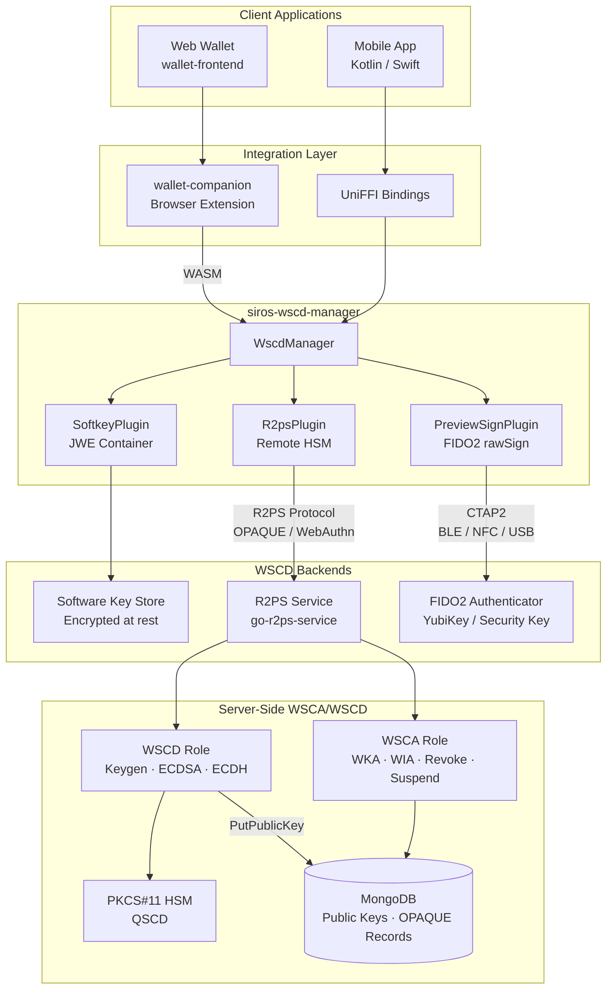
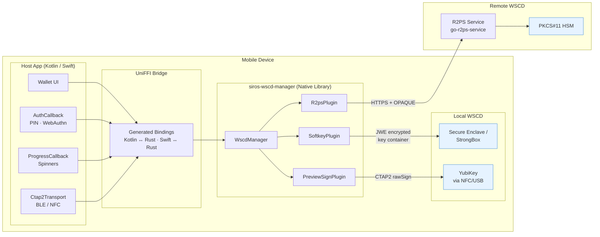
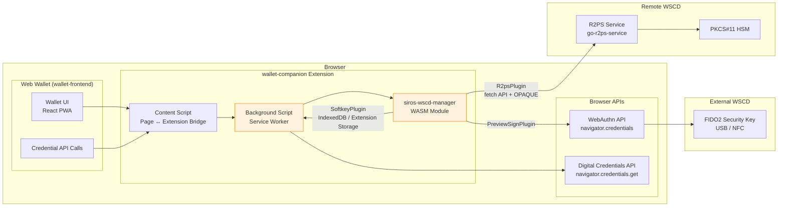
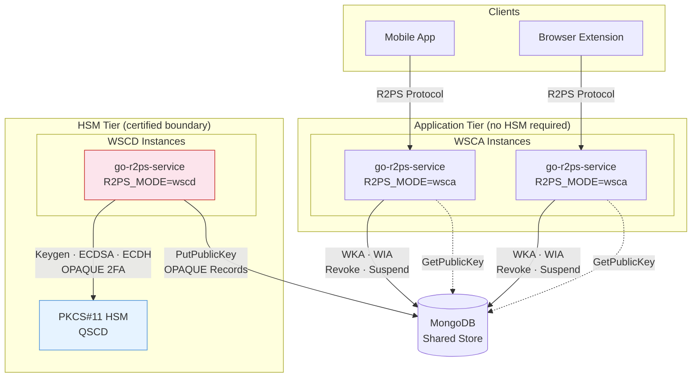
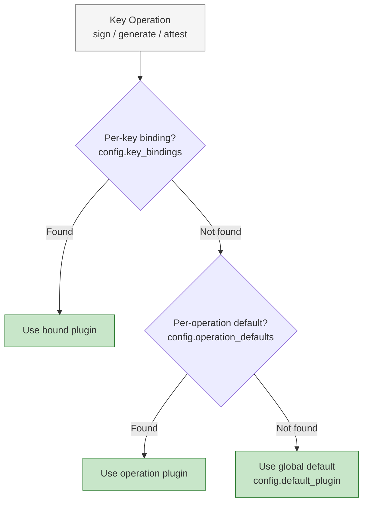
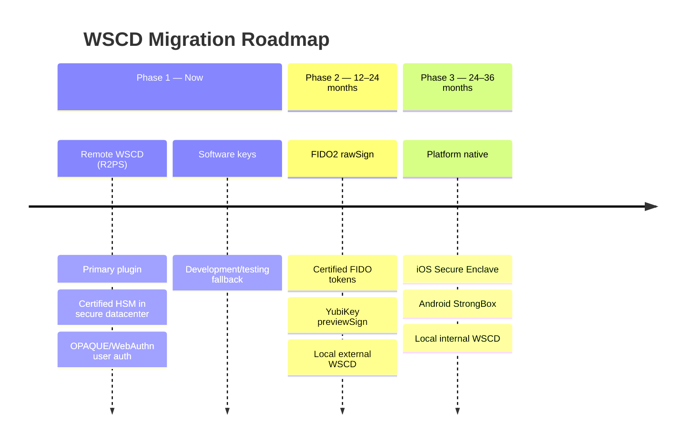

# WSCA/WSCD Architecture

This page describes the Wallet Secure Cryptographic Application (WSCA) and Wallet Secure Cryptographic Device (WSCD) architecture used by the SIROS ID platform for key management and Proof of Possession operations.

## Overview

The EUDI Wallet must support multiple WSCD backends — remote HSMs, FIDO2 security keys, and software key stores — while presenting a unified key operation API to the wallet application layer. The `siros-wscd-manager` Rust crate provides this abstraction as a pluggable manager consumed by both native mobile SDKs (via UniFFI) and web clients (via WASM through the wallet-companion browser extension).

## Component Diagram

## Native Deployment (Mobile)

In the native deployment, `siros-wscd-manager` is compiled as a Rust library and exposed to Kotlin (Android) and Swift (iOS) via [UniFFI](https://mozilla.github.io/uniffi-rs/) bindings. The host application implements the callback traits to provide UI for authentication and progress.

### Native Key Flow

1. **Key Generation**: The wallet calls `WscdManager::generate_key()`. The manager resolves the target plugin (per configuration) and delegates. For R2PS, this triggers an OPAQUE-authenticated `p256_generate` call to the remote HSM. The key binding (`kid → plugin`) is recorded automatically.
2. **Signing (PoP)**: The wallet calls `WscdManager::sign()` with the key ID. The manager looks up the key binding, resolves the plugin, and delegates. For R2PS, this runs the OPAQUE session protocol and calls `hsm_ecdsa`.
3. **Callbacks**: The host app provides `AuthCallback` (to collect the user's PIN or trigger a WebAuthn assertion) and `ProgressCallback` (to update UI spinners). For FIDO2, `Ctap2Transport` relays CTAP2 commands over BLE/NFC.

## Web Deployment (Browser Extension)

In the web deployment, `siros-wscd-manager` is compiled to WebAssembly and loaded by the **wallet-companion** browser extension. The extension bridges the gap between the web wallet (wallet-frontend) and hardware-backed key operations that are not available to pure web applications.

### Web Key Flow

1. **Extension Loading**: When wallet-companion starts, the background service worker initializes the WASM module containing `siros-wscd-manager`.
2. **Page Communication**: The web wallet communicates with the extension via `window.WalletCompanion` (injected by the content script). Key operation requests are forwarded to the background script.
3. **Plugin Routing**: The WASM `WscdManager` routes operations identically to the native case. The softkey plugin uses extension storage; the R2PS plugin uses the browser `fetch` API; the FIDO2 plugin delegates to the browser's WebAuthn API.
4. **DC API Integration**: For presentation flows, wallet-companion intercepts `navigator.credentials.get()` calls via the Digital Credentials API and routes them through the appropriate WSCD plugin for Proof of Possession signing.

## Server-Side Split Architecture (R2PS)

The `go-r2ps-service` binary supports split deployment of WSCA and WSCD roles, controlled by the `R2PS_MODE` environment variable. This reduces the certification scope of each component.

### Role Separation

| Role     | Handlers                                                                               | HSM Required | Purpose                                   |
|----------|----------------------------------------------------------------------------------------|:------------:|-------------------------------------------|
| **WSCD** | `p256_generate`, `hsm_ecdsa`, `agree_ecdh`, `list_keys` + OPAQUE 2FA                  | Yes          | Cryptographic operations on private keys  |
| **WSCA** | `eudiw_wka_etsi`, `eudiw_wia_etsi`, `eudiw_wi_revoke`, `eudiw_wi_suspend` + status lists | No           | Attestation issuance and lifecycle management |

The key insight is that **public keys are exported to the shared MongoDB store at generation time**, allowing WSCA instances to resolve keys without HSM access. This means WSCA can be scaled, updated, and redeployed independently of the WSCD certification boundary.

## Plugin Resolution

The `WscdManager` resolves which plugin handles a given operation using a three-level fallback:

## Phased Migration Strategy

The architecture supports a phased migration from remote to local WSCDs as certification matures:

Key migration between plugins is supported via `WscdManager::migrate_key()`. When the target plugin cannot import keys (e.g., migrating from softkey to R2PS), the manager signals `ReEnrollmentRequired` — the credential must be re-issued with the new public key.

## Security Properties

- **Zeroize**: All private key material is zeroized on drop via the `zeroize` crate
- **No key export**: R2PS and FIDO2 plugins never expose private keys; softkey exports only the encrypted JWE container
- **Mutex isolation**: Each plugin's internal state is behind `std::sync::Mutex`
- **OPAQUE (RFC 9807)**: R2PS authentication uses password-authenticated key exchange — the server never sees the user's PIN
- **SCAL2 compliance**: The R2PS protocol implements sole-control semantics per ETSI TS 119 431-1
