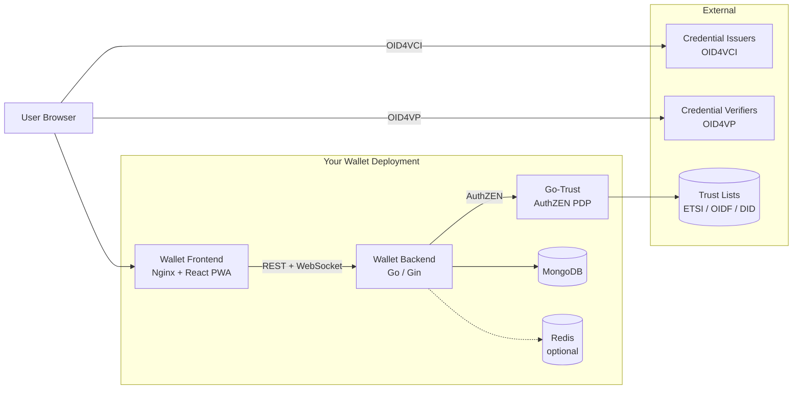

# Credential Manager Deployment

This section covers deploying your own instance of the **SIROS ID Credential Manager** — the digital wallet infrastructure that allows users to receive, store, and present verifiable credentials.

:::info This is not id.siros.org
These guides are for organizations deploying their own credential manager on a **separate origin**. If you want to use the hosted SaaS instance, point your users to [id.siros.org](https://id.siros.org) and see the [Quick Start Guide](/sirosid/quickstart) instead.
:::

## What You're Deploying

The credential manager is a self-contained wallet service consisting of three components:

| Component | Image | Purpose |
|-----------|-------|---------|
| **Wallet Frontend** | `ghcr.io/sirosfoundation/wallet-frontend` | React PWA served via Nginx — the user-facing wallet UI |
| **Wallet Backend** | `ghcr.io/sirosfoundation/go-wallet-backend` | Go service handling WebAuthn auth, credential storage, and OID4VCI/OID4VP protocol flows |
| **Go-Trust** | `ghcr.io/sirosfoundation/go-trust` | AuthZEN trust evaluation — validates issuer and verifier trust against configured trust frameworks |

Plus supporting infrastructure:

| Service | Purpose |
|---------|---------|
| **MongoDB** | Persistent storage for users, credentials, and tenant config |
| **Redis** | *(optional)* WebSocket session store for horizontally scaled deployments |

## Prerequisites

- Docker and Docker Compose (or a container orchestrator like Kubernetes)
- A domain name with TLS termination (the wallet uses WebAuthn, which requires HTTPS)
- DNS records pointing to your deployment
- MongoDB 7+ (can be containerized or managed)

## Sections

| Guide | Description |
|-------|-------------|
| [Architecture](./architecture) | Component roles, data flow, and deployment topology |
| [Configuration](./configuration) | Environment variables and config files for each component |
| [Docker Compose](./docker-compose) | Reference `docker-compose.yaml` for a complete deployment |

## Source Code

| Repository | Description |
|------------|-------------|
| [sirosfoundation/wallet-frontend](https://github.com/wwWallet/wallet-frontend) | Wallet frontend (SIROS fork of wwWallet) |
| [sirosfoundation/go-wallet-backend](https://github.com/sirosfoundation/go-wallet-backend) | Wallet backend |
| [sirosfoundation/go-trust](https://github.com/sirosfoundation/go-trust) | Trust evaluation service |

For developing and testing changes locally, see [Setting Up a Local Development Environment](../howto/local-dev-environment).
